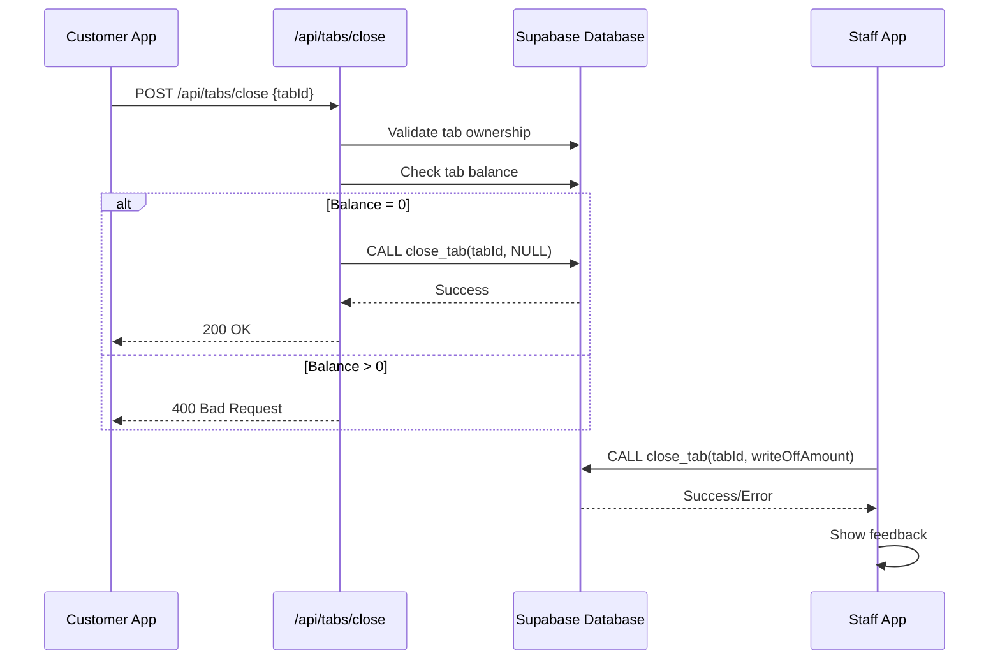
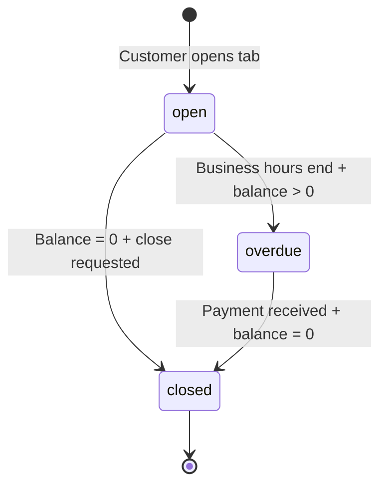

# Design Document: Fix Close Tab Errors

## Overview

This design addresses the critical tab closing errors in both the customer and staff applications. The customer app currently calls a non-existent `/api/tabs/close` endpoint, resulting in 404 errors. The staff app uses the `close_tab` RPC function directly, which may have reliability issues. This design implements a robust API endpoint for the customer app and improves error handling in the staff app.

### Key Design Decisions

1. **API-First Approach for Customer App**: Create a dedicated Next.js API route to handle tab closing with proper validation and error handling
2. **Maintain RPC for Staff App**: Keep the direct RPC call in the staff app but improve error handling and user feedback
3. **Shared Validation Logic**: Implement consistent validation rules across both apps
4. **Device-Based Authorization**: Ensure customers can only close tabs they own via device identifier matching

## Architecture

### Component Interaction



### Technology Stack

- **Frontend**: Next.js 15+ with React 19, TypeScript
- **Database**: Supabase (PostgreSQL)
- **API Layer**: Next.js API Routes (App Router)
- **Real-time**: Supabase real-time subscriptions
- **Monorepo**: pnpm workspaces with Turbo

## Components and Interfaces

### 1. Customer App Close Tab API Route

**Location**: `apps/customer/app/api/tabs/close/route.ts`

**Purpose**: Provides a secure server-side endpoint for customers to close their tabs

**Interface**:
```typescript
// Request
POST /api/tabs/close
Content-Type: application/json

{
  "tabId": string  // UUID of the tab to close
}

// Success Response (200)
{
  "success": true,
  "message": "Tab closed successfully"
}

// Error Responses
// 400 - Bad Request (missing tabId, positive balance, pending orders)
{
  "error": string,
  "details"?: {
    "balance"?: number,
    "pendingOrders"?: number
  }
}

// 401 - Unauthorized (tab doesn't belong to device)
{
  "error": "Unauthorized to close this tab"
}

// 404 - Not Found (tab doesn't exist)
{
  "error": "Tab not found"
}

// 500 - Internal Server Error
{
  "error": "Failed to close tab",
  "message": string
}
```

**Validation Logic**:
1. Extract `tabId` from request body
2. Retrieve device identifier from session/cookies
3. Query tab from database with device_identifier match
4. Calculate tab balance (confirmed orders - successful payments)
5. Check for pending orders (staff or customer initiated)
6. If balance > 0, reject with 400
7. If pending orders exist, reject with 400
8. Call `close_tab` RPC function
9. Return success or error response

### 2. Staff App Close Tab Handler

**Location**: `apps/staff/app/tabs/[id]/page.tsx` (existing component)

**Purpose**: Allows staff to close tabs or push them to overdue status

**Enhanced Error Handling**:
```typescript
interface CloseTabError {
  type: 'network' | 'validation' | 'database' | 'permission';
  message: string;
  details?: Record<string, any>;
  retryable: boolean;
}

const handleCloseTabError = (error: any): CloseTabError => {
  // Network errors
  if (error.message?.includes('fetch') || error.code === 'PGRST301') {
    return {
      type: 'network',
      message: 'Connection error. Please check your internet connection.',
      retryable: true
    };
  }
  
  // Permission errors
  if (error.code === '42501' || error.message?.includes('permission')) {
    return {
      type: 'permission',
      message: 'You do not have permission to close this tab.',
      retryable: false
    };
  }
  
  // Validation errors
  if (error.message?.includes('pending') || error.message?.includes('balance')) {
    return {
      type: 'validation',
      message: error.message,
      details: error.details,
      retryable: false
    };
  }
  
  // Database errors
  return {
    type: 'database',
    message: 'Database error occurred. Please try again or contact support.',
    details: { originalError: error.message },
    retryable: true
  };
};
```

### 3. Database RPC Function

**Function Name**: `close_tab`

**Purpose**: Centralized database function for closing tabs with optional write-off

**Signature**:
```sql
CREATE OR REPLACE FUNCTION close_tab(
  p_tab_id UUID,
  p_write_off_amount NUMERIC DEFAULT NULL
) RETURNS VOID AS $$
DECLARE
  v_tab_status TEXT;
  v_balance NUMERIC;
BEGIN
  -- Get current tab status
  SELECT status INTO v_tab_status
  FROM tabs
  WHERE id = p_tab_id;
  
  -- Validate tab exists
  IF v_tab_status IS NULL THEN
    RAISE EXCEPTION 'Tab not found';
  END IF;
  
  -- Validate tab is not already closed
  IF v_tab_status = 'closed' THEN
    RAISE EXCEPTION 'Tab is already closed';
  END IF;
  
  -- Calculate balance
  SELECT COALESCE(
    (SELECT SUM(total) FROM tab_orders WHERE tab_id = p_tab_id AND status = 'confirmed'),
    0
  ) - COALESCE(
    (SELECT SUM(amount) FROM tab_payments WHERE tab_id = p_tab_id AND status = 'success'),
    0
  ) INTO v_balance;
  
  -- If write-off amount provided, push to overdue
  IF p_write_off_amount IS NOT NULL AND p_write_off_amount > 0 THEN
    UPDATE tabs
    SET 
      status = 'overdue',
      moved_to_overdue_at = NOW(),
      overdue_reason = 'Unpaid balance: ' || p_write_off_amount::TEXT,
      closed_by = 'staff'
    WHERE id = p_tab_id;
    
    -- Log audit event
    INSERT INTO audit_logs (tab_id, action, details)
    VALUES (p_tab_id, 'tab_pushed_to_overdue', jsonb_build_object(
      'write_off_amount', p_write_off_amount,
      'balance', v_balance
    ));
  ELSE
    -- Close normally
    UPDATE tabs
    SET 
      status = 'closed',
      closed_at = NOW(),
      closed_by = COALESCE(
        (SELECT closed_by FROM tabs WHERE id = p_tab_id),
        'system'
      )
    WHERE id = p_tab_id;
    
    -- Log audit event
    INSERT INTO audit_logs (tab_id, action, details)
    VALUES (p_tab_id, 'tab_closed', jsonb_build_object(
      'final_balance', v_balance
    ));
  END IF;
END;
$$ LANGUAGE plpgsql SECURITY DEFINER;
```

## Data Models

### Tab Status Flow



### Tab Balance Calculation

```typescript
interface TabBalance {
  tabId: string;
  confirmedOrdersTotal: number;
  successfulPaymentsTotal: number;
  balance: number;
  canClose: boolean;
}

const calculateTabBalance = async (tabId: string): Promise<TabBalance> => {
  // Query confirmed orders
  const { data: orders } = await supabase
    .from('tab_orders')
    .select('total')
    .eq('tab_id', tabId)
    .eq('status', 'confirmed');
  
  const confirmedOrdersTotal = orders?.reduce((sum, o) => sum + parseFloat(o.total), 0) || 0;
  
  // Query successful payments
  const { data: payments } = await supabase
    .from('tab_payments')
    .select('amount')
    .eq('tab_id', tabId)
    .eq('status', 'success');
  
  const successfulPaymentsTotal = payments?.reduce((sum, p) => sum + parseFloat(p.amount), 0) || 0;
  
  const balance = confirmedOrdersTotal - successfulPaymentsTotal;
  
  return {
    tabId,
    confirmedOrdersTotal,
    successfulPaymentsTotal,
    balance,
    canClose: balance === 0
  };
};
```

### Pending Orders Check

```typescript
interface PendingOrdersCheck {
  hasPendingStaffOrders: boolean;
  hasPendingCustomerOrders: boolean;
  canClose: boolean;
  blockingReason?: string;
}

const checkPendingOrders = async (tabId: string): Promise<PendingOrdersCheck> => {
  const { data: orders } = await supabase
    .from('tab_orders')
    .select('id, status, initiated_by')
    .eq('tab_id', tabId)
    .eq('status', 'pending');
  
  const staffOrders = orders?.filter(o => o.initiated_by === 'staff') || [];
  const customerOrders = orders?.filter(o => o.initiated_by === 'customer') || [];
  
  const hasPendingStaffOrders = staffOrders.length > 0;
  const hasPendingCustomerOrders = customerOrders.length > 0;
  
  let blockingReason: string | undefined;
  if (hasPendingStaffOrders) {
    blockingReason = `${staffOrders.length} staff order(s) awaiting customer approval`;
  } else if (hasPendingCustomerOrders) {
    blockingReason = `${customerOrders.length} customer order(s) not yet served`;
  }
  
  return {
    hasPendingStaffOrders,
    hasPendingCustomerOrders,
    canClose: !hasPendingStaffOrders && !hasPendingCustomerOrders,
    blockingReason
  };
};
```


## Correctness Properties

*A property is a characteristic or behavior that should hold true across all valid executions of a system—essentially, a formal statement about what the system should do. Properties serve as the bridge between human-readable specifications and machine-verifiable correctness guarantees.*

### Property 1: Zero Balance Tab Closure

*For any* tab with zero balance (confirmed orders total equals successful payments total), when a close request is made by an authorized user (customer or staff), the tab status should transition to 'closed' and the closed_at timestamp should be set.

**Validates: Requirements 1.1, 2.1, 5.3, 5.5**

### Property 2: Positive Balance Rejection for Customers

*For any* tab with a positive balance (confirmed orders total exceeds successful payments total), when a customer attempts to close the tab via the API endpoint, the system should reject the request with a 400 status code and include the balance amount in the error response.

**Validates: Requirements 1.2, 3.4**

### Property 3: Positive Balance Overdue Transition for Staff

*For any* tab with a positive balance, when staff closes the tab with a write-off amount equal to the balance, the tab status should transition to 'overdue', the moved_to_overdue_at timestamp should be set, and an audit log entry should be created.

**Validates: Requirements 2.2, 5.4, 5.6**

### Property 4: Pending Orders Block Closure

*For any* tab with pending orders (either staff-initiated awaiting customer approval or customer-initiated not yet served), when a close request is made, the system should reject the closure and include details about which orders are blocking closure in the error response.

**Validates: Requirements 2.3, 2.4, 4.2**

### Property 5: Device Authorization Enforcement

*For any* tab and device identifier pair, when a customer attempts to close a tab via the API endpoint, the system should only allow closure if the tab's device_identifier matches the requesting device's identifier, otherwise returning a 401 unauthorized error.

**Validates: Requirements 1.5, 3.2**

### Property 6: API Endpoint Validation Chain

*For any* request to the `/api/tabs/close` endpoint, the system should validate in order: (1) tab ID is provided, (2) tab exists, (3) device authorization, (4) balance is zero, (5) no pending orders exist, and should return the first validation failure encountered with an appropriate error code and message.

**Validates: Requirements 3.2, 3.3, 3.6**

### Property 7: Success Response Format

*For any* successful tab closure operation (via API or RPC), the system should return a success indicator with a 200 status code (for API) or no exception (for RPC), and the response should include a confirmation message.

**Validates: Requirements 3.5**

### Property 8: Error Message Safety

*For any* error response from the tab closing functionality, the error message should be user-friendly and should not contain technical implementation details such as SQL queries, stack traces, database table names, or internal function names.

**Validates: Requirements 4.5**

### Property 9: Error Logging Completeness

*For any* tab close operation that fails due to a database error, the system should log the error details including timestamp, tab ID, user type (customer/staff), error type, and original error message to the audit_logs table or application logs.

**Validates: Requirements 4.4**

### Property 10: RPC Function Idempotency

*For any* tab that is already in 'closed' status, when the close_tab RPC function is called again with the same tab ID, the function should raise an exception indicating the tab is already closed, preventing duplicate closure operations.

**Validates: Requirements 5.3, 5.4**

## Error Handling

### Error Categories

1. **Validation Errors (400)**
   - Missing tab ID
   - Tab not found
   - Positive balance (customer only)
   - Pending orders exist
   - Tab already closed

2. **Authorization Errors (401)**
   - Device identifier mismatch
   - Insufficient permissions

3. **Network Errors (503)**
   - Database connection timeout
   - Supabase service unavailable

4. **Database Errors (500)**
   - RPC function execution failure
   - Transaction rollback
   - Constraint violations

### Error Response Format

All API errors follow this structure:

```typescript
interface ErrorResponse {
  error: string;              // User-friendly error message
  code?: string;              // Error code for client-side handling
  details?: {                 // Optional additional context
    balance?: number;
    pendingOrders?: number;
    orderIds?: string[];
  };
  retryable?: boolean;        // Whether the client should retry
}
```

### Error Handling Strategy

```typescript
const handleCloseTabError = (error: any, context: 'customer' | 'staff'): ErrorResponse => {
  // Network/connection errors
  if (error.code === 'PGRST301' || error.message?.includes('fetch')) {
    return {
      error: 'Connection error. Please check your internet connection and try again.',
      code: 'NETWORK_ERROR',
      retryable: true
    };
  }
  
  // Authorization errors
  if (error.code === '42501' || error.status === 401) {
    return {
      error: context === 'customer' 
        ? 'This tab does not belong to your device'
        : 'You do not have permission to close this tab',
      code: 'UNAUTHORIZED',
      retryable: false
    };
  }
  
  // Validation errors
  if (error.code === 'VALIDATION_ERROR') {
    return {
      error: error.message,
      code: 'VALIDATION_ERROR',
      details: error.details,
      retryable: false
    };
  }
  
  // Database errors (sanitize message)
  return {
    error: 'An error occurred while closing the tab. Please try again or contact support.',
    code: 'DATABASE_ERROR',
    retryable: true
  };
};
```

### Retry Logic

For retryable errors (network, temporary database issues):

```typescript
const closeTabWithRetry = async (
  tabId: string,
  maxRetries: number = 3,
  delayMs: number = 1000
): Promise<void> => {
  for (let attempt = 1; attempt <= maxRetries; attempt++) {
    try {
      await closeTab(tabId);
      return; // Success
    } catch (error: any) {
      const errorResponse = handleCloseTabError(error, 'customer');
      
      if (!errorResponse.retryable || attempt === maxRetries) {
        throw error; // Give up
      }
      
      // Wait before retry with exponential backoff
      await new Promise(resolve => setTimeout(resolve, delayMs * attempt));
    }
  }
};
```

## Testing Strategy

### Dual Testing Approach

This feature requires both unit tests and property-based tests to ensure comprehensive coverage:

- **Unit tests**: Verify specific examples, edge cases, and error conditions
- **Property tests**: Verify universal properties across all inputs

### Property-Based Testing

We will use **fast-check** (TypeScript property-based testing library) to implement the correctness properties defined above.

**Configuration**:
- Minimum 100 iterations per property test
- Each test tagged with: `Feature: fix-close-tab-errors, Property {number}: {property_text}`
- Tests run in CI/CD pipeline before deployment

**Example Property Test Structure**:

```typescript
import fc from 'fast-check';
import { describe, it, expect } from '@jest/globals';

describe('Feature: fix-close-tab-errors, Property 1: Zero Balance Tab Closure', () => {
  it('should close any tab with zero balance when requested by authorized user', async () => {
    await fc.assert(
      fc.asyncProperty(
        fc.record({
          tabId: fc.uuid(),
          ordersTotal: fc.nat(10000),
          paymentsTotal: fc.nat(10000),
          deviceId: fc.uuid()
        }).filter(({ ordersTotal, paymentsTotal }) => ordersTotal === paymentsTotal),
        async ({ tabId, ordersTotal, paymentsTotal, deviceId }) => {
          // Setup: Create tab with matching orders and payments
          await setupTabWithBalance(tabId, ordersTotal, paymentsTotal, deviceId);
          
          // Act: Close the tab
          const response = await fetch('/api/tabs/close', {
            method: 'POST',
            body: JSON.stringify({ tabId }),
            headers: { 'X-Device-ID': deviceId }
          });
          
          // Assert: Tab should be closed
          expect(response.status).toBe(200);
          
          const tab = await getTab(tabId);
          expect(tab.status).toBe('closed');
          expect(tab.closed_at).toBeTruthy();
        }
      ),
      { numRuns: 100 }
    );
  });
});
```

### Unit Testing Focus

Unit tests should cover:

1. **API Endpoint Examples**:
   - Successful closure with zero balance
   - Rejection with positive balance
   - Rejection with pending orders
   - Authorization failure with wrong device

2. **RPC Function Examples**:
   - Close with NULL write-off
   - Close with positive write-off
   - Error when tab already closed
   - Error when tab doesn't exist

3. **Error Handling Examples**:
   - Network error produces correct message
   - Permission error produces correct message
   - Database error is logged correctly

4. **Integration Examples**:
   - Customer app successfully closes tab
   - Staff app successfully closes tab
   - Staff app successfully pushes to overdue

### Test Data Generation

Use factories to generate consistent test data:

```typescript
const createTestTab = (overrides?: Partial<Tab>): Tab => ({
  id: uuid(),
  bar_id: uuid(),
  tab_number: Math.floor(Math.random() * 1000),
  status: 'open',
  device_identifier: uuid(),
  opened_at: new Date().toISOString(),
  ...overrides
});

const createTestOrder = (tabId: string, overrides?: Partial<Order>): Order => ({
  id: uuid(),
  tab_id: tabId,
  items: [{ name: 'Test Item', quantity: 1, price: 100 }],
  total: 100,
  status: 'confirmed',
  initiated_by: 'customer',
  created_at: new Date().toISOString(),
  ...overrides
});

const createTestPayment = (tabId: string, overrides?: Partial<Payment>): Payment => ({
  id: uuid(),
  tab_id: tabId,
  amount: 100,
  method: 'cash',
  status: 'success',
  created_at: new Date().toISOString(),
  ...overrides
});
```

### Testing Checklist

- [ ] API endpoint returns 200 for valid zero-balance closure
- [ ] API endpoint returns 400 for positive-balance closure
- [ ] API endpoint returns 401 for unauthorized device
- [ ] API endpoint returns 404 for non-existent tab
- [ ] RPC function closes tab with NULL write-off
- [ ] RPC function pushes to overdue with positive write-off
- [ ] RPC function raises exception for already-closed tab
- [ ] Error messages are user-friendly (no SQL/stack traces)
- [ ] Database errors are logged to audit_logs
- [ ] Timestamps are set correctly on closure
- [ ] Pending orders block closure
- [ ] Property tests pass with 100+ iterations
