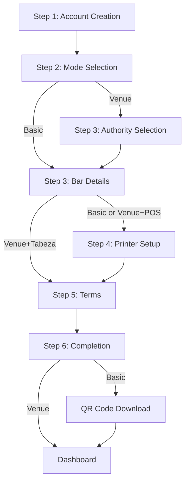

# Design Document: Integrated Signup Onboarding

## Overview

This design consolidates the staff signup and venue onboarding into a single, continuous multi-step flow. The current implementation separates these concerns: users complete a basic signup, navigate to settings, and then encounter a modal for onboarding. This creates friction and confusion.

The redesigned flow integrates mode selection (Basic vs Venue), authority configuration (POS vs Tabeza), and conditional setup steps directly into the signup process. Users complete everything in one session and land on the dashboard ready to use the system.

### Key Design Principles

1. **Progressive Disclosure**: Show only relevant steps based on user choices
2. **Early Decision Making**: Mode selection happens before venue details to guide subsequent steps
3. **Atomic Transactions**: All data saved in one database operation
4. **Component Reuse**: Leverage existing DriverInstallationGuidance and validation utilities
5. **Core Truth Compliance**: Enforce singular digital authority model throughout

## Architecture

### High-Level Flow



### Step Sequence by Configuration

**Basic Mode Path:**
1. Account Creation
2. Mode Selection (Basic)
3. Bar Details
4. Printer Installation
5. Terms & Conditions
6. QR Code Download
7. Dashboard

**Venue + POS Path:**
1. Account Creation
2. Mode Selection (Venue)
3. Authority Selection (POS)
4. Bar Details
5. Printer Installation
6. Terms & Conditions
7. Dashboard

**Venue + Tabeza Path:**
1. Account Creation
2. Mode Selection (Venue)
3. Authority Selection (Tabeza)
4. Bar Details
5. Terms & Conditions
6. Dashboard


## Components and Interfaces

### Component Architecture

```
SignupPage (apps/staff/app/signup/page.tsx)
├── AccountCreationStep
│   ├── Email input with validation
│   ├── Password input with strength indicator
│   └── Confirm password input
├── ModeSelectionStep
│   ├── BasicModeCard (🔵 Blue theme)
│   └── VenueModeCard (🟢 Green theme)
├── AuthoritySelectionStep (Venue only)
│   ├── POSAuthorityCard (🟡 Yellow theme)
│   └── TabezaAuthorityCard (🟢 Green theme)
├── BarDetailsStep
│   ├── Venue name input
│   ├── Location input
│   ├── Phone input
│   └── Slug generation
├── PrinterSetupStep (Basic & Venue+POS)
│   └── DriverInstallationGuidance (reused component)
├── TermsStep
│   ├── Terms text display
│   └── Acceptance checkboxes
├── CompletionStep
│   ├── QRCodeDisplay (Basic only)
│   └── Success message
└── ProgressIndicator
    └── Step counter with visual feedback
```

### State Management

```typescript
interface SignupState {
  // Current step tracking
  currentStep: SignupStep;
  completedSteps: SignupStep[];
  
  // Account data
  email: string;
  password: string;
  confirmPassword: string;
  
  // Configuration data
  venueMode: 'basic' | 'venue' | null;
  authorityMode: 'pos' | 'tabeza' | null;
  
  // Venue data
  barName: string;
  location: string;
  phone: string;
  slug: string;
  
  // Setup flags
  printerRequired: boolean;
  printerSetupComplete: boolean;
  termsAccepted: boolean;
  
  // Progress persistence
  progressSaved: boolean;
  lastSaveTimestamp: number;
  
  // Error handling
  errors: Record<string, string>;
  validationErrors: string[];
  
  // Loading states
  isCreatingAccount: boolean;
  isSavingConfiguration: boolean;
  isGeneratingQR: boolean;
}

enum SignupStep {
  ACCOUNT = 'account',
  MODE_SELECTION = 'mode_selection',
  AUTHORITY_SELECTION = 'authority_selection',
  BAR_DETAILS = 'bar_details',
  PRINTER_SETUP = 'printer_setup',
  TERMS = 'terms',
  COMPLETION = 'completion'
}
```

### Key Interfaces

```typescript
interface VenueConfiguration {
  venue_mode: 'basic' | 'venue';
  authority_mode: 'pos' | 'tabeza';
  pos_integration_enabled: boolean;
  printer_required: boolean;
  onboarding_completed: boolean;
}

interface BarCreationData {
  name: string;
  location: string;
  phone: string;
  email: string;
  slug: string;
  venue_mode: 'basic' | 'venue';
  authority_mode: 'pos' | 'tabeza';
  pos_integration_enabled: boolean;
  printer_required: boolean;
  onboarding_completed: boolean;
}

interface SignupProgress {
  step: SignupStep;
  email: string;
  venueMode: 'basic' | 'venue' | null;
  authorityMode: 'pos' | 'tabeza' | null;
  barName: string;
  location: string;
  phone: string;
  printerSetupComplete: boolean;
  timestamp: number;
}
```

## Data Models

### Database Schema Changes

No new tables required. The existing `bars` table already has all necessary fields:

```sql
-- Existing bars table columns used:
-- venue_mode: venue_mode_enum ('basic', 'venue')
-- authority_mode: authority_mode_enum ('pos', 'tabeza')
-- pos_integration_enabled: boolean
-- printer_required: boolean
-- onboarding_completed: boolean
-- name, location, phone, email, slug
```

### Configuration Validation Rules

```typescript
// Core Truth validation rules
const CONFIGURATION_RULES = {
  basic: {
    venue_mode: 'basic',
    authority_mode: 'pos',
    pos_integration_enabled: true,
    printer_required: true,
    onboarding_completed: true
  },
  venue_pos: {
    venue_mode: 'venue',
    authority_mode: 'pos',
    pos_integration_enabled: true,
    printer_required: true,
    onboarding_completed: true
  },
  venue_tabeza: {
    venue_mode: 'venue',
    authority_mode: 'tabeza',
    pos_integration_enabled: false,
    printer_required: false,
    onboarding_completed: true
  }
};
```

## API Integration

### Signup API Flow

```typescript
// 1. Create authentication account
POST /auth/signup
{
  email: string;
  password: string;
}
Response: { user: User, session: Session }

// 2. Create bar with full configuration
POST /api/bars/create
{
  user_id: string;
  name: string;
  location: string;
  phone: string;
  email: string;
  slug: string;
  venue_mode: 'basic' | 'venue';
  authority_mode: 'pos' | 'tabeza';
  pos_integration_enabled: boolean;
  printer_required: boolean;
  onboarding_completed: true;
}
Response: { bar_id: string, qr_code_url?: string }

// 3. Update user metadata
POST /auth/user/update
{
  data: { bar_id: string }
}
Response: { success: boolean }
```

### API Route Implementation

```typescript
// apps/staff/app/api/signup/complete/route.ts
export async function POST(request: Request) {
  const {
    userId,
    email,
    barName,
    location,
    phone,
    venueMode,
    authorityMode
  } = await request.json();
  
  // Validate configuration
  const config = validateVenueConfiguration({
    venue_mode: venueMode,
    authority_mode: authorityMode
  });
  
  if (!config.isValid) {
    return Response.json({ 
      error: config.errors.join(', ') 
    }, { status: 400 });
  }
  
  // Generate slug
  const slug = generateSlug(barName);
  
  // Create bar with full configuration
  const { data: bar, error: barError } = await supabase
    .from('bars')
    .insert({
      name: barName,
      location,
      phone,
      email,
      slug,
      venue_mode: venueMode,
      authority_mode: authorityMode,
      pos_integration_enabled: config.correctedConfig.pos_integration_enabled,
      printer_required: config.correctedConfig.printer_required,
      onboarding_completed: true
    })
    .select()
    .single();
    
  if (barError) throw barError;
  
  // Create user-bar association
  await supabase
    .from('user_bars')
    .insert({
      user_id: userId,
      bar_id: bar.id,
      role: 'owner'
    });
  
  // Generate QR code for Basic mode
  let qrCodeUrl = null;
  if (venueMode === 'basic') {
    qrCodeUrl = await generateQRCode(bar.id, slug);
  }
  
  return Response.json({
    success: true,
    barId: bar.id,
    qrCodeUrl
  });
}
```

## UI/UX Specifications

### Theme Configuration

```typescript
const THEME_CONFIG = {
  basic: {
    primary: 'blue-600',
    secondary: 'blue-100',
    accent: 'blue-500',
    icon: '🔵',
    gradient: 'from-blue-500 to-blue-700'
  },
  venue_pos: {
    primary: 'yellow-600',
    secondary: 'yellow-100',
    accent: 'yellow-500',
    icon: '🟡',
    gradient: 'from-yellow-500 to-orange-600'
  },
  venue_tabeza: {
    primary: 'green-600',
    secondary: 'green-100',
    accent: 'green-500',
    icon: '🟢',
    gradient: 'from-green-500 to-green-700'
  }
};
```

### Mode Selection Cards

```tsx
// Basic Mode Card
<div className="border-2 border-blue-500 bg-blue-50 rounded-xl p-6">
  <div className="flex items-center gap-3 mb-4">
    <div className="w-12 h-12 bg-blue-100 rounded-xl flex items-center justify-center">
      <Printer size={24} className="text-blue-600" />
    </div>
    <div>
      <h3 className="text-xl font-bold">Tabeza Basic</h3>
      <p className="text-sm text-blue-600">Transaction & Receipt Bridge</p>
      <div className="flex gap-1 mt-1">
        <span>🖨️</span><span>📱</span><span>💳</span>
      </div>
    </div>
  </div>
  <p className="text-gray-600 mb-4">
    I have a POS system and want digital receipts
  </p>
  <ul className="space-y-2">
    <li className="flex items-center gap-2">
      <Check size={16} className="text-green-600" />
      <span className="text-sm">Works with existing POS</span>
    </li>
    <li className="flex items-center gap-2">
      <Check size={16} className="text-green-600" />
      <span className="text-sm">Digital receipt delivery</span>
    </li>
    <li className="flex items-center gap-2">
      <Check size={16} className="text-green-600" />
      <span className="text-sm">Thermal printer required</span>
    </li>
  </ul>
</div>

// Venue Mode Card
<div className="border-2 border-green-500 bg-green-50 rounded-xl p-6">
  <div className="flex items-center gap-3 mb-4">
    <div className="w-12 h-12 bg-green-100 rounded-xl flex items-center justify-center">
      <Menu size={24} className="text-green-600" />
    </div>
    <div>
      <h3 className="text-xl font-bold">Tabeza Venue</h3>
      <p className="text-sm text-green-600">Customer Interaction & Service</p>
      <div className="flex gap-1 mt-1">
        <span>📋</span><span>💬</span><span>💳</span>
      </div>
    </div>
  </div>
  <p className="text-gray-600 mb-4">
    I want full customer ordering and menus
  </p>
  <ul className="space-y-2">
    <li className="flex items-center gap-2">
      <Check size={16} className="text-green-600" />
      <span className="text-sm">Digital menus & ordering</span>
    </li>
    <li className="flex items-center gap-2">
      <Check size={16} className="text-green-600" />
      <span className="text-sm">Two-way messaging</span>
    </li>
    <li className="flex items-center gap-2">
      <Check size={16} className="text-green-600" />
      <span className="text-sm">Works with or without POS</span>
    </li>
  </ul>
</div>
```

### Progress Indicator

```tsx
<div className="flex items-center justify-center mb-8">
  <div className="flex items-center gap-2">
    {steps.map((step, index) => (
      <React.Fragment key={step}>
        <div className={`w-8 h-8 rounded-full flex items-center justify-center text-sm font-bold ${
          currentStepIndex > index 
            ? 'bg-green-500 text-white' 
            : currentStepIndex === index
              ? 'bg-orange-500 text-white'
              : 'bg-gray-200 text-gray-500'
        }`}>
          {currentStepIndex > index ? <CheckCircle size={20} /> : index + 1}
        </div>
        {index < steps.length - 1 && (
          <div className={`w-12 h-1 ${
            currentStepIndex > index ? 'bg-green-500' : 'bg-gray-200'
          }`} />
        )}
      </React.Fragment>
    ))}
  </div>
</div>
```

### QR Code Display (Basic Mode)

```tsx
<div className="bg-white rounded-xl shadow-lg p-8 max-w-md mx-auto">
  <div className="text-center mb-6">
    <div className="w-16 h-16 bg-blue-100 rounded-full flex items-center justify-center mx-auto mb-4">
      <Check size={32} className="text-blue-600" />
    </div>
    <h2 className="text-2xl font-bold text-gray-800 mb-2">
      Setup Complete!
    </h2>
    <p className="text-gray-600">
      Download your venue QR code to get started
    </p>
  </div>
  
  <div className="bg-gray-50 rounded-lg p-6 mb-6">
    
  </div>
  
  <div className="space-y-3">
    <button className="w-full px-6 py-3 bg-blue-600 text-white rounded-lg hover:bg-blue-700 flex items-center justify-center gap-2">
      <Download size={20} />
      Download PNG
    </button>
    <button className="w-full px-6 py-3 bg-blue-600 text-white rounded-lg hover:bg-blue-700 flex items-center justify-center gap-2">
      <Download size={20} />
      Download PDF
    </button>
  </div>
  
  <button 
    onClick={() => router.push('/dashboard')}
    className="w-full mt-4 px-6 py-3 bg-gray-100 text-gray-700 rounded-lg hover:bg-gray-200"
  >
    Continue to Dashboard
  </button>
</div>
```

## Correctness Properties

Before writing correctness properties, I need to analyze the acceptance criteria for testability.


## Correctness Properties

A property is a characteristic or behavior that should hold true across all valid executions of a system—essentially, a formal statement about what the system should do. Properties serve as the bridge between human-readable specifications and machine-verifiable correctness guarantees.

### Property Reflection

After analyzing all acceptance criteria, I've identified the following property categories:

1. **Configuration Properties**: Core Truth validation (Basic mode → POS authority, etc.)
2. **State Transition Properties**: Step navigation and data preservation
3. **Validation Properties**: Input validation and error handling
4. **Persistence Properties**: Progress saving and restoration (round-trip)
5. **UI State Properties**: Theme application and conditional rendering

Some properties can be combined:
- Properties 2.4, 9.2 can be combined into "Basic mode configuration enforcement"
- Properties 3.3, 9.3 can be combined into "Venue+POS configuration enforcement"
- Properties 3.4, 9.4 can be combined into "Venue+Tabeza configuration enforcement"
- Properties 8.1, 8.4, 8.5 can be combined into "Progress persistence round-trip"

### Core Configuration Properties

Property 1: Basic Mode Configuration Enforcement
*For any* signup flow where Basic mode is selected, the system SHALL set venue_mode='basic', authority_mode='pos', pos_integration_enabled=true, and printer_required=true
**Validates: Requirements 2.4, 9.2**

Property 2: Venue+POS Configuration Enforcement
*For any* signup flow where Venue mode and POS authority are selected, the system SHALL set venue_mode='venue', authority_mode='pos', pos_integration_enabled=true, and printer_required=true
**Validates: Requirements 3.3, 9.3**

Property 3: Venue+Tabeza Configuration Enforcement
*For any* signup flow where Venue mode and Tabeza authority are selected, the system SHALL set venue_mode='venue', authority_mode='tabeza', pos_integration_enabled=false, and printer_required=false
**Validates: Requirements 3.4, 9.4**

Property 4: Configuration Validation
*For any* venue configuration input, the validation function SHALL reject invalid combinations and accept only Core Truth-compliant configurations
**Validates: Requirements 9.1**

### State Transition Properties

Property 5: Step Progression
*For any* valid step transition, advancing forward SHALL update the current step and preserve all previously entered data
**Validates: Requirements 1.4, 2.5, 2.6, 3.5, 4.4, 5.5, 6.4, 7.6**

Property 6: Backward Navigation
*For any* step past the first, clicking back SHALL return to the previous step without losing any entered data
**Validates: Requirements 11.3**

Property 7: Conditional Navigation
*For any* signup flow, the step sequence SHALL match the configuration: Basic mode skips authority selection, Venue+Tabeza skips printer setup
**Validates: Requirements 2.6, 5.6, 10.5**

### Validation Properties

Property 8: Email and Password Validation
*For any* email and password input, the validation SHALL accept valid credentials (email with @, password ≥6 chars) and reject invalid ones
**Validates: Requirements 1.2**

Property 9: Required Fields Validation
*For any* bar details input, the validation SHALL require non-empty venue name, location, and phone number
**Validates: Requirements 4.2**

Property 10: Terms Acceptance Validation
*For any* completion attempt, the system SHALL prevent proceeding without explicit terms acceptance
**Validates: Requirements 6.5**

Property 11: Step Validation Before Advancement
*For any* forward navigation attempt, the system SHALL validate the current step and only proceed if validation passes
**Validates: Requirements 11.4, 11.5**

### Persistence Properties

Property 12: Progress Persistence Round-Trip
*For any* signup progress state, saving to localStorage then restoring SHALL produce an equivalent state with all data preserved
**Validates: Requirements 8.1, 8.4**

Property 13: Progress Cleanup on Completion
*For any* successful signup completion, the system SHALL clear all localStorage progress data
**Validates: Requirements 8.5**

Property 14: Database Transaction Atomicity
*For any* signup completion, all configuration data SHALL be saved in a single database transaction with onboarding_completed=true
**Validates: Requirements 7.1, 7.2, 7.3**

### UI State Properties

Property 15: Theme Application
*For any* configuration state (Basic, Venue+POS, Venue+Tabeza), the UI SHALL apply the corresponding theme (blue, yellow, green respectively)
**Validates: Requirements 13.1, 13.2, 13.3**

Property 16: Progress Indicator Display
*For any* step in the signup flow, the progress indicator SHALL show the current step number and total steps
**Validates: Requirements 11.1**

Property 17: Conditional UI Elements
*For any* step past the first, the back button SHALL be displayed; for any step with validation errors, the forward button SHALL be disabled
**Validates: Requirements 11.2, 11.5**

Property 18: Error Message Display
*For any* validation failure, the system SHALL display specific error messages and highlight the fields requiring correction
**Validates: Requirements 12.1, 12.4**

Property 19: Error Clearing
*For any* error state, correcting the invalid input SHALL clear the associated error message
**Validates: Requirements 12.5**

### QR Code Properties

Property 20: Basic Mode QR Generation
*For any* Basic mode venue completion, the system SHALL generate a unique QR code containing the venue slug and name
**Validates: Requirements 10.1, 10.4**

Property 21: QR Display Conditional
*For any* venue mode configuration, QR code display SHALL only appear for Basic mode venues
**Validates: Requirements 7.5, 10.5**

### Slug Generation Property

Property 22: Slug Uniqueness
*For any* venue name, the generated slug SHALL be URL-safe, unique, and derived from the venue name
**Validates: Requirements 4.5**

## Error Handling

### Error Categories

1. **Validation Errors**: Invalid input data (email format, empty fields, etc.)
2. **Authentication Errors**: Account creation failures (duplicate email, weak password, etc.)
3. **Network Errors**: Connection failures, timeouts
4. **Database Errors**: Transaction failures, constraint violations
5. **Configuration Errors**: Invalid venue/authority combinations

### Error Handling Strategy

```typescript
interface ErrorState {
  type: 'validation' | 'auth' | 'network' | 'database' | 'configuration';
  message: string;
  field?: string;
  canRetry: boolean;
  retryAction?: () => Promise<void>;
}

// Error handling patterns
const handleError = (error: Error, context: string): ErrorState => {
  // Network errors - always retryable
  if (error.name === 'TypeError' && error.message.includes('fetch')) {
    return {
      type: 'network',
      message: 'Unable to connect. Please check your internet connection.',
      canRetry: true,
      retryAction: async () => { /* retry last operation */ }
    };
  }
  
  // Auth errors - specific handling
  if (error.message.includes('already registered')) {
    return {
      type: 'auth',
      message: 'This email is already registered. Please sign in instead.',
      field: 'email',
      canRetry: false
    };
  }
  
  // Database errors - retryable with backoff
  if (error.message.includes('database')) {
    return {
      type: 'database',
      message: 'Failed to save configuration. Please try again.',
      canRetry: true,
      retryAction: async () => { /* retry with exponential backoff */ }
    };
  }
  
  // Configuration errors - not retryable, need user correction
  if (error.message.includes('invalid configuration')) {
    return {
      type: 'configuration',
      message: error.message,
      canRetry: false
    };
  }
  
  // Generic fallback
  return {
    type: 'validation',
    message: error.message || 'An error occurred. Please try again.',
    canRetry: true
  };
};
```

### Error Recovery

```typescript
// Progress preservation on error
const handleSignupError = async (error: Error, currentState: SignupState) => {
  // Save current progress
  await saveProgress({
    step: currentState.currentStep,
    email: currentState.email,
    venueMode: currentState.venueMode,
    authorityMode: currentState.authorityMode,
    barName: currentState.barName,
    location: currentState.location,
    phone: currentState.phone,
    printerSetupComplete: currentState.printerSetupComplete,
    timestamp: Date.now()
  });
  
  // Classify and display error
  const errorState = handleError(error, 'signup');
  setError(errorState);
  
  // Offer retry if applicable
  if (errorState.canRetry && errorState.retryAction) {
    setRetryAction(() => errorState.retryAction);
  }
};
```

## Progress Persistence Implementation

### LocalStorage Schema

```typescript
interface StoredProgress {
  version: number; // Schema version for migrations
  step: SignupStep;
  email: string;
  venueMode: 'basic' | 'venue' | null;
  authorityMode: 'pos' | 'tabeza' | null;
  barName: string;
  location: string;
  phone: string;
  printerSetupComplete: boolean;
  timestamp: number;
  expiresAt: number; // 24 hours from creation
}

const PROGRESS_KEY = 'tabeza_signup_progress';
const PROGRESS_EXPIRY_MS = 24 * 60 * 60 * 1000; // 24 hours
```

### Save Progress

```typescript
const saveProgress = (state: SignupState): void => {
  const progress: StoredProgress = {
    version: 1,
    step: state.currentStep,
    email: state.email,
    venueMode: state.venueMode,
    authorityMode: state.authorityMode,
    barName: state.barName,
    location: state.location,
    phone: state.phone,
    printerSetupComplete: state.printerSetupComplete,
    timestamp: Date.now(),
    expiresAt: Date.now() + PROGRESS_EXPIRY_MS
  };
  
  try {
    localStorage.setItem(PROGRESS_KEY, JSON.stringify(progress));
  } catch (error) {
    console.warn('Failed to save signup progress:', error);
  }
};
```

### Restore Progress

```typescript
const restoreProgress = (): StoredProgress | null => {
  try {
    const stored = localStorage.getItem(PROGRESS_KEY);
    if (!stored) return null;
    
    const progress: StoredProgress = JSON.parse(stored);
    
    // Check expiry
    if (Date.now() > progress.expiresAt) {
      clearProgress();
      return null;
    }
    
    // Validate schema version
    if (progress.version !== 1) {
      console.warn('Incompatible progress version, clearing');
      clearProgress();
      return null;
    }
    
    return progress;
  } catch (error) {
    console.warn('Failed to restore signup progress:', error);
    clearProgress();
    return null;
  }
};
```

### Clear Progress

```typescript
const clearProgress = (): void => {
  try {
    localStorage.removeItem(PROGRESS_KEY);
  } catch (error) {
    console.warn('Failed to clear signup progress:', error);
  }
};
```

### Resume Flow

```tsx
// On component mount
useEffect(() => {
  const savedProgress = restoreProgress();
  
  if (savedProgress) {
    // Show resume dialog
    setShowResumeDialog(true);
    setSavedProgress(savedProgress);
  }
}, []);

// Resume dialog
{showResumeDialog && savedProgress && (
  <div className="fixed inset-0 bg-black/50 flex items-center justify-center z-50">
    <div className="bg-white rounded-xl p-6 max-w-md">
      <h3 className="text-xl font-bold mb-4">Resume Signup?</h3>
      <p className="text-gray-600 mb-6">
        We found your previous signup progress. Would you like to continue where you left off?
      </p>
      <div className="flex gap-3">
        <button
          onClick={() => {
            clearProgress();
            setShowResumeDialog(false);
          }}
          className="flex-1 px-4 py-2 border border-gray-300 rounded-lg hover:bg-gray-50"
        >
          Start Over
        </button>
        <button
          onClick={() => {
            restoreState(savedProgress);
            setShowResumeDialog(false);
          }}
          className="flex-1 px-4 py-2 bg-orange-500 text-white rounded-lg hover:bg-orange-600"
        >
          Resume
        </button>
      </div>
    </div>
  </div>
)}
```

## QR Code Generation

### QR Code Service

```typescript
import QRCode from 'qrcode';

interface QRCodeOptions {
  barId: string;
  slug: string;
  venueName: string;
  format: 'png' | 'pdf';
}

const generateQRCode = async (options: QRCodeOptions): Promise<string> => {
  const { barId, slug, venueName, format } = options;
  
  // Generate customer URL
  const customerUrl = `${process.env.NEXT_PUBLIC_CUSTOMER_URL}/${slug}`;
  
  // Generate QR code as data URL
  const qrDataUrl = await QRCode.toDataURL(customerUrl, {
    width: 512,
    margin: 2,
    color: {
      dark: '#000000',
      light: '#FFFFFF'
    }
  });
  
  if (format === 'png') {
    return qrDataUrl;
  }
  
  // For PDF, create a document with venue info
  return await generateQRCodePDF({
    qrDataUrl,
    venueName,
    customerUrl
  });
};

const generateQRCodePDF = async (data: {
  qrDataUrl: string;
  venueName: string;
  customerUrl: string;
}): Promise<string> => {
  // Use jsPDF or similar to create PDF
  // Include:
  // - Venue name as title
  // - QR code image
  // - Customer URL text
  // - Instructions: "Scan to open a tab at [venue name]"
  
  // Return PDF as data URL or blob URL
  return 'data:application/pdf;base64,...';
};
```

### QR Code Storage

```typescript
// Save QR code to Supabase Storage
const saveQRCode = async (barId: string, qrDataUrl: string): Promise<string> => {
  // Convert data URL to blob
  const response = await fetch(qrDataUrl);
  const blob = await response.blob();
  
  // Upload to Supabase Storage
  const fileName = `qr-codes/${barId}.png`;
  const { data, error } = await supabase.storage
    .from('venue-assets')
    .upload(fileName, blob, {
      contentType: 'image/png',
      upsert: true
    });
    
  if (error) throw error;
  
  // Get public URL
  const { data: { publicUrl } } = supabase.storage
    .from('venue-assets')
    .getPublicUrl(fileName);
    
  // Update bar record with QR code URL
  await supabase
    .from('bars')
    .update({ qr_code_url: publicUrl })
    .eq('id', barId);
    
  return publicUrl;
};
```

## Integration with Existing Components

### DriverInstallationGuidance Integration

The existing `DriverInstallationGuidance` component will be embedded in the printer setup step:

```tsx
// In PrinterSetupStep component
{printerRequired && (
  <div className="max-w-4xl mx-auto">
    <div className="mb-6">
      <h2 className="text-2xl font-bold text-gray-800 mb-2">
        Printer Driver Installation
      </h2>
      <p className="text-gray-600">
        Install Tabeza printer drivers to enable POS integration
      </p>
    </div>
    
    <DriverInstallationGuidance
      onDriversConfirmed={() => {
        setDriversInstalled(true);
        // Enable continue button
      }}
      onSkip={() => {
        // Show warning that printer is required
        setError('Printer drivers are required for your configuration');
      }}
    />
    
    <div className="mt-6 flex justify-between">
      <button
        onClick={handleBack}
        className="px-6 py-3 border border-gray-300 rounded-lg hover:bg-gray-50"
      >
        Back
      </button>
      <button
        onClick={handleContinue}
        disabled={!driversInstalled}
        className={`px-6 py-3 rounded-lg ${
          driversInstalled
            ? 'bg-orange-500 text-white hover:bg-orange-600'
            : 'bg-gray-300 text-gray-500 cursor-not-allowed'
        }`}
      >
        Continue
      </button>
    </div>
  </div>
)}
```

### VenueModeOnboarding Reference

The existing `VenueModeOnboarding` component provides UI patterns for mode selection. Key elements to reuse:

1. **Mode Selection Cards**: Visual design and layout
2. **Theme Configuration**: Color schemes and icons
3. **Validation Feedback**: Error display patterns
4. **Network Status**: Offline handling patterns

```tsx
// Reuse theme configuration from VenueModeOnboarding
import { getVenueThemeConfig } from '../contexts/ThemeContext';

const theme = getVenueThemeConfig(venueMode, authorityMode);

// Apply theme to mode selection cards
<div className={`border-2 border-${theme.primary} bg-${theme.secondary} rounded-xl p-6`}>
  {/* Card content */}
</div>
```

### Validation Service Integration

```typescript
import { 
  validateVenueConfiguration,
  generateCorrectedConfiguration 
} from '@tabeza/shared';

// Validate configuration before saving
const validateAndSave = async (state: SignupState) => {
  const validation = validateVenueConfiguration({
    venue_mode: state.venueMode!,
    authority_mode: state.authorityMode!
  });
  
  if (!validation.isValid) {
    setValidationErrors(validation.errors);
    return false;
  }
  
  // Use corrected configuration
  const config = validation.correctedConfig!;
  
  await saveConfiguration(config);
  return true;
};
```

## Testing Strategy

### Dual Testing Approach

1. **Unit Tests**: Verify specific examples, edge cases, and error conditions
2. **Property Tests**: Verify universal properties across all inputs

### Unit Testing Focus

- Specific UI examples (mode selection cards, progress indicator)
- Integration points (auth API, database operations)
- Edge cases (expired progress, network failures)
- Error conditions (invalid configurations, validation failures)

### Property Testing Focus

- Configuration validation (Properties 1-4)
- State transitions (Properties 5-7)
- Input validation (Properties 8-11)
- Progress persistence (Properties 12-13)
- UI state management (Properties 15-19)

### Property Test Configuration

- Minimum 100 iterations per property test
- Each test references its design document property
- Tag format: **Feature: integrated-signup-onboarding, Property {number}: {property_text}**

### Example Property Test

```typescript
import fc from 'fast-check';

describe('Feature: integrated-signup-onboarding, Property 1: Basic Mode Configuration Enforcement', () => {
  it('should enforce correct configuration for Basic mode', () => {
    fc.assert(
      fc.property(
        fc.record({
          barName: fc.string({ minLength: 1 }),
          location: fc.string({ minLength: 1 }),
          phone: fc.string({ minLength: 1 })
        }),
        (barDetails) => {
          // Simulate Basic mode selection
          const state = createSignupState();
          state.venueMode = 'basic';
          
          // Apply configuration
          const config = applyModeConfiguration(state);
          
          // Verify Core Truth constraints
          expect(config.venue_mode).toBe('basic');
          expect(config.authority_mode).toBe('pos');
          expect(config.pos_integration_enabled).toBe(true);
          expect(config.printer_required).toBe(true);
        }
      ),
      { numRuns: 100 }
    );
  });
});
```

### Example Unit Test

```typescript
describe('Mode Selection Step', () => {
  it('should display Basic and Venue mode options', () => {
    render(<ModeSelectionStep onSelect={jest.fn()} />);
    
    expect(screen.getByText('Tabeza Basic')).toBeInTheDocument();
    expect(screen.getByText('Tabeza Venue')).toBeInTheDocument();
    expect(screen.getByText('I have a POS system and want digital receipts')).toBeInTheDocument();
    expect(screen.getByText('I want full customer ordering and menus')).toBeInTheDocument();
  });
  
  it('should apply blue theme to Basic mode card', () => {
    render(<ModeSelectionStep onSelect={jest.fn()} />);
    
    const basicCard = screen.getByText('Tabeza Basic').closest('div');
    expect(basicCard).toHaveClass('border-blue-500');
    expect(basicCard).toHaveClass('bg-blue-50');
  });
});
```

