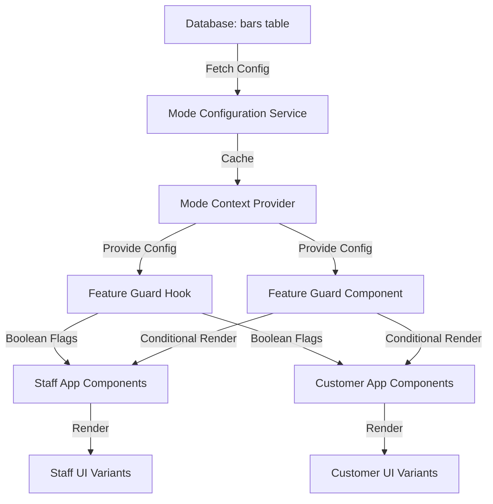
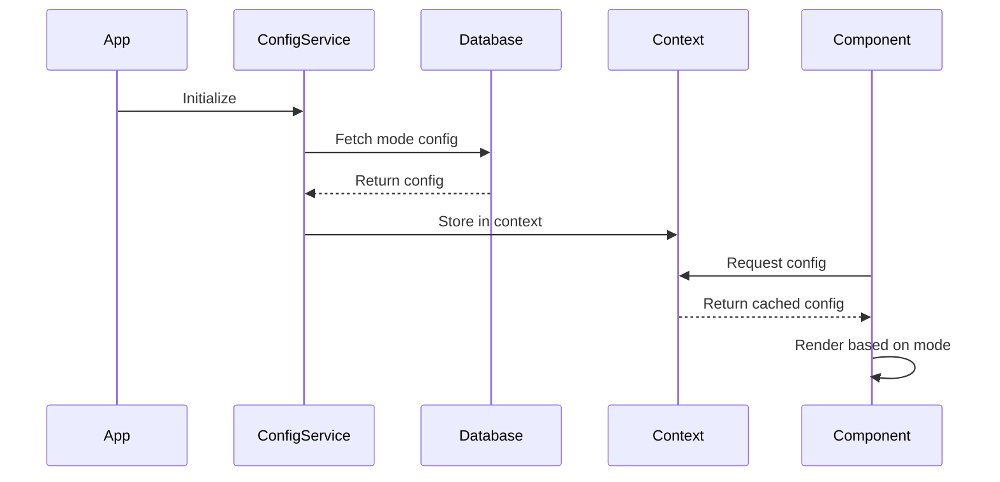
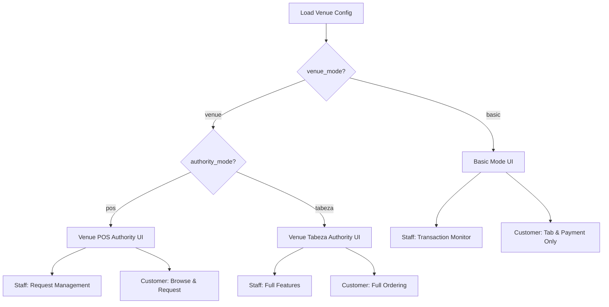

# Design Document: Mode-Based UI Differentiation

## Overview

This design implements a comprehensive mode-based UI differentiation system for Tabeza that adapts both staff and customer applications based on venue operating mode (Basic vs Venue) and authority configuration (POS vs Tabeza). The system ensures users only see features available to them, preventing confusion and maintaining the core truth that manual service always exists with singular digital authority.

The design follows a layered approach:
1. **Configuration Layer**: Fetches and caches venue mode configuration
2. **Feature Guard Layer**: Provides reusable components and hooks for conditional rendering
3. **UI Variant Layer**: Implements specific UI layouts for each mode combination
4. **Navigation Layer**: Dynamically adapts navigation based on available features

## Architecture

### System Components



### Mode Configuration Flow



### UI Variant Decision Tree



## Components and Interfaces

### 1. Mode Configuration Service

**Purpose**: Fetch and manage venue mode configuration from the database.

**Location**: `packages/shared/services/modeConfigService.ts`

**Interface**:
```typescript
interface ModeConfiguration {
  venue_mode: 'basic' | 'venue';
  authority_mode: 'pos' | 'tabeza';
  pos_integration_enabled: boolean;
  printer_required: boolean;
  onboarding_completed: boolean;
}

interface ModeConfigService {
  /**
   * Fetch mode configuration for a specific venue
   * @param barId - The venue's unique identifier
   * @returns Promise resolving to mode configuration
   * @throws Error if configuration cannot be fetched or is invalid
   */
  fetchModeConfig(barId: string): Promise<ModeConfiguration>;
  
  /**
   * Validate mode configuration against business rules
   * @param config - Configuration to validate
   * @returns true if valid, throws Error with message if invalid
   */
  validateModeConfig(config: ModeConfiguration): boolean;
  
  /**
   * Check if a specific feature is available in the given mode
   * @param config - Current mode configuration
   * @param feature - Feature identifier
   * @returns true if feature is available
   */
  isFeatureAvailable(config: ModeConfiguration, feature: FeatureFlag): boolean;
}
```

**Implementation Notes**:
- Uses Supabase client to query bars table
- Implements validation based on database constraints
- Throws descriptive errors for invalid configurations
- Caches configuration per session to minimize database queries

### 2. Mode Context Provider

**Purpose**: Provide mode configuration throughout the React component tree using Context API.

**Location**: `packages/shared/contexts/ModeContext.tsx`

**Interface**:
```typescript
interface ModeContextValue {
  config: ModeConfiguration | null;
  loading: boolean;
  error: Error | null;
  refetch: () => Promise<void>;
  isFeatureAvailable: (feature: FeatureFlag) => boolean;
}

interface ModeProviderProps {
  barId: string;
  children: React.ReactNode;
}

/**
 * Provider component that fetches and caches mode configuration
 * Wraps the application to provide mode context to all components
 */
export function ModeProvider({ barId, children }: ModeProviderProps): JSX.Element;

/**
 * Hook to access mode configuration from context
 * @throws Error if used outside ModeProvider
 */
export function useModeConfig(): ModeContextValue;
```

**Implementation Notes**:
- Fetches configuration on mount using barId
- Stores configuration in React state
- Provides loading and error states
- Implements refetch function for manual refresh
- Memoizes isFeatureAvailable function for performance

### 3. Feature Guard Hook

**Purpose**: Provide boolean flags for feature availability based on mode configuration.

**Location**: `packages/shared/hooks/useFeatureGuard.ts`

**Interface**:
```typescript
type FeatureFlag = 
  | 'menu_management'
  | 'order_creation'
  | 'customer_ordering'
  | 'customer_requests'
  | 'messaging'
  | 'promotions'
  | 'printer_config'
  | 'timed_availability';

interface FeatureGuardFlags {
  // Staff features
  canManageMenus: boolean;
  canCreateOrders: boolean;
  canManagePromotions: boolean;
  canConfigurePrinter: boolean;
  canManageTimedAvailability: boolean;
  canViewRequests: boolean;
  canMessage: boolean;
  
  // Customer features
  canBrowseMenus: boolean;
  canPlaceOrders: boolean;
  canSubmitRequests: boolean;
  canViewPromotions: boolean;
  
  // Mode indicators
  isBasicMode: boolean;
  isVenueMode: boolean;
  isPOSAuthority: boolean;
  isTabezaAuthority: boolean;
}

/**
 * Hook that returns feature availability flags based on current mode
 * @returns Object with boolean flags for each feature
 */
export function useFeatureGuard(): FeatureGuardFlags;
```

**Implementation Notes**:
- Uses useModeConfig hook internally
- Computes all flags based on mode configuration
- Memoizes result to prevent unnecessary re-renders
- Returns consistent object shape for TypeScript safety

### 4. Feature Guard Component

**Purpose**: Conditionally render children based on feature availability.

**Location**: `packages/shared/components/FeatureGuard.tsx`

**Interface**:
```typescript
interface FeatureGuardProps {
  feature: FeatureFlag;
  fallback?: React.ReactNode;
  children: React.ReactNode;
}

/**
 * Component that conditionally renders children based on feature availability
 * @param feature - The feature flag to check
 * @param fallback - Optional component to render when feature is unavailable
 * @param children - Content to render when feature is available
 */
export function FeatureGuard({ 
  feature, 
  fallback, 
  children 
}: FeatureGuardProps): JSX.Element | null;
```

**Usage Example**:
```typescript
<FeatureGuard 
  feature="menu_management"
  fallback={<UnavailableMessage feature="Menu Management" />}
>
  <MenuManagementPanel />
</FeatureGuard>
```

**Implementation Notes**:
- Uses useModeConfig hook to check feature availability
- Returns null if feature unavailable and no fallback provided
- Renders fallback if provided and feature unavailable
- Renders children if feature available

### 5. Mode Indicator Component

**Purpose**: Display current operating mode in staff application.

**Location**: `apps/staff/components/ModeIndicator.tsx`

**Interface**:
```typescript
interface ModeIndicatorProps {
  variant?: 'badge' | 'banner' | 'inline';
  showDetails?: boolean;
}

/**
 * Component that displays the current venue operating mode
 * @param variant - Visual style of the indicator
 * @param showDetails - Whether to show detailed mode information
 */
export function ModeIndicator({ 
  variant = 'badge', 
  showDetails = false 
}: ModeIndicatorProps): JSX.Element;
```

**Visual Design**:
- **Basic Mode**: Blue badge with printer icon
- **Venue Mode (POS)**: Yellow badge with hybrid icon
- **Venue Mode (Tabeza)**: Green badge with full-service icon
- Tooltip on hover showing detailed configuration

### 6. Unavailable Feature Message Component

**Purpose**: Display informative messages when features are unavailable.

**Location**: `packages/shared/components/UnavailableFeatureMessage.tsx`

**Interface**:
```typescript
interface UnavailableFeatureMessageProps {
  feature: string;
  context: 'staff' | 'customer';
  showUpgradeOption?: boolean;
}

/**
 * Component that displays why a feature is unavailable
 * @param feature - Name of the unavailable feature
 * @param context - Whether this is for staff or customer
 * @param showUpgradeOption - Whether to show mode upgrade information
 */
export function UnavailableFeatureMessage({
  feature,
  context,
  showUpgradeOption = false
}: UnavailableFeatureMessageProps): JSX.Element;
```

**Message Templates**:
- Basic Mode Staff: "Menu management is not available in Basic mode. Orders are managed through your POS system."
- Venue POS Authority Staff: "Order creation is handled by your POS system. Use Tabeza to view customer requests."
- Basic Mode Customer: "Ordering is not available. Please place orders with staff who will use the POS system."
- Venue POS Authority Customer: "Submit requests to staff who will confirm them in the POS system."

### 7. Dynamic Navigation Component

**Purpose**: Generate navigation menus based on available features.

**Location**: `apps/staff/components/Navigation.tsx` and `apps/customer/components/Navigation.tsx`

**Interface**:
```typescript
interface NavigationItem {
  id: string;
  label: string;
  icon: React.ComponentType;
  href: string;
  requiredFeature?: FeatureFlag;
  badge?: string;
}

interface DynamicNavigationProps {
  items: NavigationItem[];
  variant?: 'sidebar' | 'bottom' | 'top';
}

/**
 * Component that renders navigation with feature-based filtering
 * @param items - All possible navigation items
 * @param variant - Navigation layout style
 */
export function DynamicNavigation({
  items,
  variant = 'sidebar'
}: DynamicNavigationProps): JSX.Element;
```

**Implementation Notes**:
- Filters navigation items based on requiredFeature
- Maintains consistent ordering across modes
- Highlights active route
- Adapts layout based on variant prop

## Data Models

### Mode Configuration Schema

The mode configuration is stored in the `bars` table with the following relevant columns:

```sql
CREATE TYPE venue_mode_enum AS ENUM ('basic', 'venue');
CREATE TYPE authority_mode_enum AS ENUM ('pos', 'tabeza');

ALTER TABLE bars ADD COLUMN venue_mode venue_mode_enum DEFAULT 'venue';
ALTER TABLE bars ADD COLUMN authority_mode authority_mode_enum DEFAULT 'tabeza';
ALTER TABLE bars ADD COLUMN pos_integration_enabled BOOLEAN DEFAULT false;
ALTER TABLE bars ADD COLUMN printer_required BOOLEAN DEFAULT false;
ALTER TABLE bars ADD COLUMN onboarding_completed BOOLEAN DEFAULT false;

-- Constraint: Basic mode requires POS authority
ALTER TABLE bars ADD CONSTRAINT bars_venue_authority_check 
  CHECK (
    (venue_mode = 'basic' AND authority_mode = 'pos') OR
    (venue_mode = 'venue' AND authority_mode IN ('pos', 'tabeza'))
  );

-- Constraint: Basic mode requires printer
ALTER TABLE bars ADD CONSTRAINT bars_printer_requirement_check
  CHECK (
    (venue_mode = 'basic' AND printer_required = true) OR
    (venue_mode = 'venue')
  );

-- Constraint: POS authority requires integration enabled
ALTER TABLE bars ADD CONSTRAINT bars_pos_integration_check
  CHECK (
    (authority_mode = 'pos' AND pos_integration_enabled = true) OR
    (authority_mode = 'tabeza' AND pos_integration_enabled = false)
  );
```

### Feature Flag Mapping

The following table defines which features are available in each mode combination:

| Feature | Basic + POS | Venue + POS | Venue + Tabeza |
|---------|-------------|-------------|----------------|
| **Staff Features** |
| Menu Management | ❌ | 👁️ View Only | ✅ Full |
| Order Creation | ❌ | ❌ | ✅ |
| Request Management | ❌ | ✅ | ✅ |
| Messaging | ❌ | ✅ | ✅ |
| Promotions | ❌ | ❌ | ✅ |
| Printer Config | ✅ | ✅ | ❌ |
| Timed Availability | ❌ | ✅ | ✅ |
| **Customer Features** |
| Browse Menus | ❌ | ✅ | ✅ |
| Place Orders | ❌ | ❌ | ✅ |
| Submit Requests | ❌ | ✅ | ❌ |
| View Promotions | ❌ | ❌ | ✅ |
| Messaging | ❌ | ✅ | ✅ |
| View Tab | ✅ | ✅ | ✅ |
| Make Payments | ✅ | ✅ | ✅ |

### TypeScript Type Definitions

```typescript
// Core mode types
export type VenueMode = 'basic' | 'venue';
export type AuthorityMode = 'pos' | 'tabeza';

// Mode configuration
export interface ModeConfiguration {
  venue_mode: VenueMode;
  authority_mode: AuthorityMode;
  pos_integration_enabled: boolean;
  printer_required: boolean;
  onboarding_completed: boolean;
}

// Feature flags
export type FeatureFlag = 
  | 'menu_management'
  | 'order_creation'
  | 'customer_ordering'
  | 'customer_requests'
  | 'messaging'
  | 'promotions'
  | 'printer_config'
  | 'timed_availability';

// UI variant identifiers
export type StaffUIVariant = 
  | 'basic_pos'
  | 'venue_pos'
  | 'venue_tabeza';

export type CustomerUIVariant =
  | 'basic'
  | 'venue_request'
  | 'venue_order';

// Mode validation result
export interface ModeValidationResult {
  valid: boolean;
  errors: string[];
}
```

## Correctness Properties

*A property is a characteristic or behavior that should hold true across all valid executions of a system—essentially, a formal statement about what the system should do. Properties serve as the bridge between human-readable specifications and machine-verifiable correctness guarantees.*

