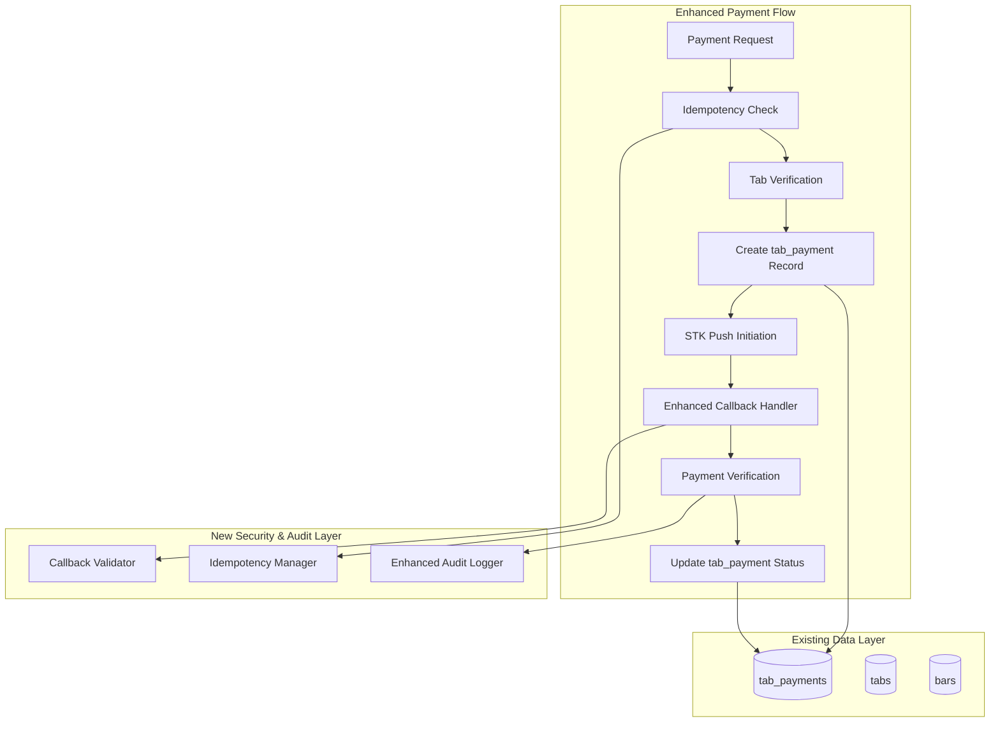

# Design Document: M-Pesa Payment System Audit

## Overview

This design addresses the audit and improvement of Tabeza's existing M-Pesa payment system, which already uses the `tab_payments` table for payment tracking. The current system has strong foundations in tab resolution, error handling, and real-time notifications. However, based on production-grade payment system best practices, several targeted enhancements are needed to prevent race conditions, improve callback security, and ensure reliable payment processing.

The design focuses on enhancing the existing payment flow by adding idempotency protection, improving callback validation, strengthening database constraints, and adding comprehensive audit logging. These improvements work with the current `tab_payments` architecture rather than replacing it.

Key research findings indicate that [idempotency keys are essential](https://readmedium.com/the-way-psps-such-as-paypal-stripe-and-adyen-prevent-duplicate-payment-idempotency-keys-615845c185bf) for preventing duplicate charges, and [webhook signature verification is critical](https://inventivehq.com/blog/webhook-signature-verification-guide) for securing payment callbacks.

## Architecture

### Current System Strengths

The existing M-Pesa system provides:
- Multi-tenant configuration with encrypted credential storage
- Robust tab resolution with multiple fallback strategies  
- Comprehensive error handling and logging
- Real-time notifications and balance updates
- Mock mode support for testing
- Auto-close logic for overdue tabs
- **Existing `tab_payments` table** for payment tracking with proper constraints

### Enhanced Architecture Components



### Integration with Existing System

The enhanced system builds upon existing components:
- **tab_payments table**: Enhanced with additional metadata fields for M-Pesa tracking
- **Tab Resolution Service**: Uses existing multi-strategy tab resolution
- **M-Pesa Configuration**: Uses current encrypted credential management
- **Real-time Notifications**: Extends existing notification system

## Components and Interfaces

### Enhanced tab_payments Metadata

The existing `tab_payments` table will be enhanced to store M-Pesa specific data in the `metadata` JSONB field:

```typescript
interface MpesaPaymentMetadata {
  // M-Pesa specific fields
  checkout_request_id?: string;
  merchant_request_id?: string;
  mpesa_receipt_number?: string;
  phone_number: string;
  
  // Idempotency and tracking
  idempotency_key: string;
  environment: 'sandbox' | 'production';
  
  // Callback tracking
  callback_received_at?: string;
  callback_processed_at?: string;
  callback_data?: any;
  
  // Verification
  amount_verified?: boolean;
  receipt_verified?: boolean;
  verification_errors?: string[];
}
```

### Idempotency Manager

```typescript
interface IdempotencyManager {
  generateKey(tabId: string, amount: number): string;
  checkDuplicate(key: string): Promise<string | null>; // Returns existing payment ID if duplicate
  recordPayment(key: string, paymentId: string): Promise<void>;
  cleanupExpired(): Promise<number>;
}
```

### Enhanced Callback Handler

```typescript
interface CallbackValidationResult {
  isValid: boolean;
  errors: string[];
  paymentId?: string;
  tab?: Tab;
}

interface CallbackHandler {
  validateCallback(request: CallbackRequest): Promise<CallbackValidationResult>;
  processValidCallback(data: ValidCallbackData): Promise<void>;
  handleDuplicateCallback(checkoutRequestId: string): Promise<void>;
}
```

### Payment Verifier

```typescript
interface PaymentVerificationResult {
  isValid: boolean;
  amountMatches: boolean;
  receiptUnique: boolean;
  errors: string[];
}

interface PaymentVerifier {
  verifyPayment(paymentId: string): Promise<PaymentVerificationResult>;
  validateReceiptNumber(receiptNumber: string): Promise<boolean>;
  flagForManualReview(paymentId: string, reason: string): Promise<void>;
}
```

## Data Models

### Enhanced tab_payments Table

The existing `tab_payments` table will be enhanced with additional constraints and indexes:

```sql
-- Add unique constraint for M-Pesa checkout request IDs
ALTER TABLE tab_payments 
ADD CONSTRAINT tab_payments_mpesa_checkout_unique 
UNIQUE ((metadata->>'checkout_request_id')) 
WHERE method = 'mpesa' AND metadata->>'checkout_request_id' IS NOT NULL;

-- Add unique constraint for M-Pesa receipt numbers
ALTER TABLE tab_payments 
ADD CONSTRAINT tab_payments_mpesa_receipt_unique 
UNIQUE ((metadata->>'mpesa_receipt_number')) 
WHERE method = 'mpesa' AND metadata->>'mpesa_receipt_number' IS NOT NULL;

-- Add unique constraint for idempotency keys
ALTER TABLE tab_payments 
ADD CONSTRAINT tab_payments_idempotency_unique 
UNIQUE ((metadata->>'idempotency_key')) 
WHERE metadata->>'idempotency_key' IS NOT NULL;

-- Add indexes for M-Pesa specific queries
CREATE INDEX idx_tab_payments_mpesa_checkout 
ON tab_payments ((metadata->>'checkout_request_id')) 
WHERE method = 'mpesa';

CREATE INDEX idx_tab_payments_mpesa_receipt 
ON tab_payments ((metadata->>'mpesa_receipt_number')) 
WHERE method = 'mpesa';

CREATE INDEX idx_tab_payments_idempotency 
ON tab_payments ((metadata->>'idempotency_key'));

-- Add check constraint for M-Pesa required fields
ALTER TABLE tab_payments 
ADD CONSTRAINT tab_payments_mpesa_metadata_check 
CHECK (
  method != 'mpesa' OR (
    metadata ? 'phone_number' AND 
    metadata ? 'idempotency_key' AND
    metadata ? 'environment'
  )
);
```

### Idempotency Tracking Table

A simple table to track idempotency keys with automatic cleanup:

```sql
CREATE TABLE payment_idempotency (
  idempotency_key VARCHAR(255) PRIMARY KEY,
  tab_payment_id UUID NOT NULL REFERENCES tab_payments(id) ON DELETE CASCADE,
  created_at TIMESTAMPTZ NOT NULL DEFAULT NOW(),
  expires_at TIMESTAMPTZ NOT NULL DEFAULT (NOW() + INTERVAL '1 hour')
);

CREATE INDEX idx_payment_idempotency_expires ON payment_idempotency(expires_at);
CREATE INDEX idx_payment_idempotency_payment ON payment_idempotency(tab_payment_id);
```

### Enhanced Audit Logging

Extend the existing audit system with payment-specific events:

```sql
-- Add payment-specific audit event types
ALTER TABLE audit_logs 
DROP CONSTRAINT IF EXISTS audit_logs_action_check;

ALTER TABLE audit_logs 
ADD CONSTRAINT audit_logs_action_check 
CHECK (action IN (
  -- Existing actions
  'tab_opened', 'tab_closed', 'order_placed', 'order_confirmed',
  -- New payment actions
  'payment_initiated', 'payment_callback_received', 'payment_verified',
  'payment_completed', 'payment_failed', 'payment_flagged_for_review'
));

-- Add payment-specific indexes
CREATE INDEX idx_audit_logs_payment_events 
ON audit_logs(action, created_at) 
WHERE action LIKE 'payment_%';
```
## Correctness Properties

*A property is a characteristic or behavior that should hold true across all valid executions of a system-essentially, a formal statement about what the system should do. Properties serve as the bridge between human-readable specifications and machine-verifiable correctness guarantees.*

Based on the prework analysis, the following properties ensure the correctness of the enhanced M-Pesa payment system:

### Idempotency and Duplicate Prevention Properties

**Property 1: Idempotency Key Generation and Storage**
*For any* M-Pesa payment request, an idempotency key must be generated and stored before creating the tab_payment record
**Validates: Requirements 1.1**

**Property 2: Duplicate Payment Prevention**
*For any* repeated idempotency key, the system must return the existing tab_payment record instead of creating a duplicate
**Validates: Requirements 1.2**

**Property 3: Payment Request Validation**
*For any* M-Pesa payment creation attempt, tab existence and payment amount validation must complete successfully before the tab_payment record is created
**Validates: Requirements 1.3**

**Property 4: Single Pending Payment Per Tab**
*For any* tab, only one tab_payment record with method='mpesa' and status='pending' can exist at any given time
**Validates: Requirements 1.4**

**Property 5: Idempotency Key Cleanup**
*For any* idempotency key that has exceeded its expiry time, the system must automatically clean up the expired key within the configured timeout period
**Validates: Requirements 1.5**

### Tab Resolution Properties

**Property 6: Callback Tab Resolution Strategy**
*For any* payment callback processing, the tab resolver must employ the existing multi-strategy resolution system with proper fallback mechanisms
**Validates: Requirements 2.1, 2.4**

**Property 7: Tab Resolution Failure Logging**
*For any* tab resolution failure, detailed diagnostic information must be logged with sufficient context for troubleshooting
**Validates: Requirements 2.2**

**Property 8: Multiple Tab Selection Logic**
*For any* device with multiple active tabs, the system must select the most recent active tab while applying appropriate safety checks
**Validates: Requirements 2.3**

**Property 9: Tab Verification Failure Handling**
*For any* tab verification failure, the payment must be rejected and appropriate customer notification must be sent
**Validates: Requirements 2.5**

### Callback Security Properties

**Property 10: Callback Signature Validation**
*For any* incoming payment callback, request signature and origin validation must be performed and pass before processing
**Validates: Requirements 3.1**

**Property 11: Callback Field Validation**
*For any* callback data processing, all required fields must be present and valid according to the M-Pesa specification
**Validates: Requirements 3.2**

**Property 12: Callback Intent Validation**
*For any* callback that references a payment intent, the intent must exist and be in a valid state for callback processing
**Validates: Requirements 3.3**

**Property 13: Callback Deduplication**
*For any* duplicate callback request (same checkout_request_id), only the first valid callback should be processed
**Validates: Requirements 3.4**

**Property 14: Callback Validation Failure Logging**
*For any* callback validation failure, the failure must be logged with complete details and appropriate error response returned
**Validates: Requirements 3.5**

### Database Integrity Properties

**Property 15: M-Pesa Unique Constraint Enforcement**
*For any* attempt to create duplicate M-Pesa checkout request IDs or receipt numbers in tab_payments, database unique constraints must prevent the duplication
**Validates: Requirements 4.1**

**Property 16: M-Pesa Payment Transaction Atomicity**
*For any* M-Pesa payment record creation operation, database transactions must ensure atomicity - either all related records are created or none are
**Validates: Requirements 4.2**

**Property 17: M-Pesa Metadata Validation Constraints**
*For any* tab_payment record with method='mpesa', the metadata field must contain required M-Pesa fields (phone_number, idempotency_key, environment)
**Validates: Requirements 4.3**

**Property 18: Concurrent M-Pesa Payment Conflict Handling**
*For any* concurrent M-Pesa payment attempts on the same tab, database conflicts must be handled gracefully without data corruption
**Validates: Requirements 4.4**

**Property 19: M-Pesa Query Optimization**
*For any* M-Pesa-specific query (by checkout_request_id, receipt_number, or idempotency_key), appropriate indexes must provide efficient query performance
**Validates: Requirements 4.5**

### Payment Verification Properties

**Property 20: Payment Amount Verification**
*For any* completed payment, the payment amount must match the outstanding tab balance within acceptable tolerance
**Validates: Requirements 5.1**

**Property 21: Receipt Number Uniqueness**
*For any* M-Pesa receipt number, it must be unique across all transactions and pass authenticity validation
**Validates: Requirements 5.2**

**Property 22: M-Pesa Cross-Reference Verification**
*For any* payment requiring verification, cross-referencing with M-Pesa transaction queries must be performed when validation rules indicate it's needed
**Validates: Requirements 5.3**

**Property 23: Payment Verification Failure Flagging**
*For any* payment verification failure, the payment must be flagged for manual review with appropriate reason codes
**Validates: Requirements 5.4**

**Property 24: Payment Status State Machine**
*For any* payment status transition, the change must follow valid state machine rules (e.g., pending → processing → completed)
**Validates: Requirements 5.5**

### Error Handling Properties

**Property 25: Error Categorization**
*For any* payment error occurrence, the error must be categorized by type and severity according to predefined classification rules
**Validates: Requirements 6.1**

**Property 26: Recoverable Error Retry Logic**
*For any* recoverable error detection, automatic retry mechanisms with exponential backoff must be implemented within configured limits
**Validates: Requirements 6.2**

**Property 27: Unrecoverable Error Messaging**
*For any* unrecoverable error occurrence, clear and actionable error messages must be provided to both customers and staff
**Validates: Requirements 6.3**

**Property 28: Comprehensive Error Logging**
*For any* error occurrence, complete error details must be logged with sufficient context for debugging and monitoring
**Validates: Requirements 6.4**

**Property 29: Payment Failure State Consistency**
*For any* payment processing failure, the associated tab state must remain consistent and recoverable
**Validates: Requirements 6.5**

### Audit Trail Properties

**Property 30: Comprehensive Event Logging**
*For any* payment-related event (intent creation/modification/completion, callback receipt/processing, tab resolution attempt, verification operation), the event must be logged with complete details in the audit trail
**Validates: Requirements 7.1, 7.2, 7.3, 7.4**

**Property 31: Audit Log Compliance Quality**
*For any* audit log entry, it must contain sufficient detail and context to meet regulatory compliance requirements and support effective debugging
**Validates: Requirements 7.5**

## Error Handling

The enhanced error handling system categorizes errors into recoverable and unrecoverable types:

### Recoverable Errors
- Network timeouts during STK Push
- Temporary database connection issues
- M-Pesa service temporary unavailability
- Tab resolution temporary failures

**Recovery Strategy**: Exponential backoff retry with maximum attempt limits and circuit breaker patterns.

### Unrecoverable Errors
- Invalid payment amounts or currency
- Tab not found after all resolution strategies
- Callback signature validation failures
- Database constraint violations

**Handling Strategy**: Immediate failure with clear error messages, comprehensive logging, and appropriate user notifications.

### Error Context Preservation
All errors maintain context including:
- Payment intent ID and tab ID
- User device information
- Timestamp and request correlation IDs
- Full error stack traces for debugging

## Testing Strategy

The testing strategy employs a dual approach combining unit tests for specific scenarios and property-based tests for comprehensive coverage:

### Unit Testing Focus
- **Specific Examples**: Test known edge cases and integration points
- **Error Conditions**: Validate specific error scenarios and recovery paths
- **Mock Integration**: Test with controlled M-Pesa API responses
- **Database Constraints**: Verify specific constraint enforcement scenarios

### Property-Based Testing Configuration
- **Testing Library**: fast-check for TypeScript/JavaScript property-based testing
- **Minimum Iterations**: 100 iterations per property test to ensure statistical coverage
- **Test Tagging**: Each property test tagged with format: **Feature: mpesa-payment-system-audit, Property {number}: {property_text}**
- **Generator Strategy**: Custom generators for payment data, tab states, callback payloads, and error conditions

### Property Test Implementation
Each correctness property maps to a dedicated property-based test:
- **Payment Intent Properties**: Generate random payment requests, tab states, and timing scenarios
- **Tab Resolution Properties**: Generate various device/session combinations and failure scenarios  
- **Callback Properties**: Generate malformed, duplicate, and valid callback payloads
- **Database Properties**: Generate concurrent access patterns and constraint violation attempts
- **Verification Properties**: Generate payment data with various amount/receipt combinations
- **Error Handling Properties**: Generate error conditions across all system components
- **Audit Properties**: Generate event sequences and verify complete logging

### Integration Testing
- **End-to-End Flows**: Complete payment flows from intent creation to completion
- **Failure Recovery**: Test system behavior under various failure conditions
- **Concurrent Access**: Multi-threaded testing for race condition detection
- **Performance**: Load testing with realistic payment volumes

The comprehensive testing approach ensures that both specific known issues and general correctness properties are validated, providing confidence in the system's reliability under production conditions.