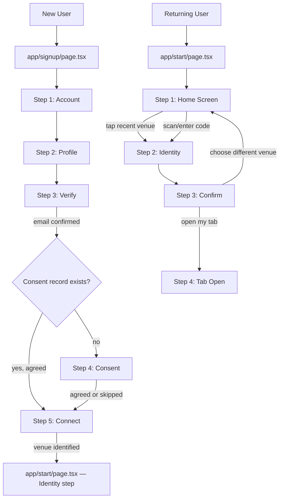

# Design Document: Onboarding & Consent Flow

## Overview

This document describes the technical design for two distinct user journeys in the Tabeza Customer app:

- **Flow A — Signup Flow (5 steps):** Account → Profile → Verify → Consent → Connect  
  A first-time user creates an account, verifies their email, gives one-time data consent, and connects to their first venue. Lives at `app/signup/page.tsx`.

- **Flow B — Connect Flow (4 steps):** Home → Identity → Confirm → Tab Open  
  An authenticated returning user opens the app, sees their home screen with recent venues, chooses how to appear at a venue, reviews a confirm screen, and lands on an active tab. Lives at `app/start/page.tsx`.

Both flows share the existing Tabeza dark/amber design system (`globals.css`, `tailwind.config.js`) and the real SVG logo from `public/logo.svg`. The `Logo` component is updated to render the SVG mark. Consent is collected exactly once during signup and never re-asked during the connect flow.

---

## Architecture

### High-Level Flow



### State Management

Both wizards are client components that manage step state locally with `useState`. No global state manager is needed — all inter-step data (venue slug, identity selection, profile data) is passed via local state lifted to the wizard root component.

```
SignupWizard state:
  step: 0..4
  email, password              (Account step)
  firstName, lastName, mobile  (Profile step)
  consentDecision              (Consent step — 'agreed' | 'skipped')

ConnectWizard state:
  step: 0..3
  selectedVenue: { id, slug, name, category, tier, visitDots }
  identityMode: 'named' | 'nickname' | 'anonymous'
  nickname: string
  activeTab: { id, venueSlug, identity, tier, paymentMethod }
```

### Routing

No new routes are introduced. Both wizards are single-page multi-step components:

| Path | Component | Purpose |
|------|-----------|---------|
| `/signup` | `app/signup/page.tsx` | Signup wizard (refactored) |
| `/start` | `app/start/page.tsx` | Connect wizard (refactored, existing logic preserved) |

The connect wizard at `/start` accepts an optional `?bar=<slug>` query param (existing behaviour) to pre-populate the venue and skip directly to the Identity step. The existing `?scanner=true` param and all tab-creation logic in `ConsentContent` are preserved intact.

---

## Components and Interfaces

### Updated: `components/Logo.tsx`

Replaces the current orange-box-with-T with the real SVG mark via `next/image`.

```typescript
interface LogoProps {
  size?: 'sm' | 'md' | 'lg'   // default: 'md'
  className?: string
}
```

Size map (width × height in pixels, preserving the square viewBox of `public/logo.svg`):

| size | px |
|------|----|
| `sm` | 24 × 24 |
| `md` | 32 × 32 |
| `lg` | 48 × 48 |

Implementation approach: use `next/image` with `src="/logo.svg"`, explicit `width`/`height` from the size map, and `alt="Tabeza"`. The `className` prop is forwarded to the wrapping `<span>` for layout overrides. If the image fails to load, the `onError` handler swaps `src` to an empty transparent data URI, preserving the layout space without a broken-image icon.

The existing `variant` prop idea (default/white) is deferred — `public/logo-white.svg` does not exist yet. The single `logo.svg` is used for all contexts; colour inversion for light backgrounds can be achieved via CSS `filter: invert(1)` if needed.

```tsx
// components/Logo.tsx — new implementation sketch
import Image from 'next/image'

const sizeMap = { sm: 24, md: 32, lg: 48 }

export default function Logo({ size = 'md', className = '' }: LogoProps) {
  const px = sizeMap[size]
  return (
    <span className={`inline-flex items-center ${className}`}>
      <Image
        src="/logo.svg"
        alt="Tabeza"
        width={px}
        height={px}
        priority
        onError={(e) => {
          (e.currentTarget as HTMLImageElement).src =
            'data:image/gif;base64,R0lGODlhAQABAIAAAAAAAP///yH5BAEAAAAALAAAAAABAAEAAAIBRAA7'
        }}
      />
    </span>
  )
}
```

### Signup Wizard: `app/signup/page.tsx`

The existing file is refactored into a 5-step wizard. All existing Supabase auth calls are preserved; new steps are added around them.

```
SignupPage (default export, Suspense wrapper)
└── SignupWizard ('use client')
    ├── StepAccount       — email + password, supabase.auth.signUp
    ├── StepProfile       — firstName, lastName, mobile
    ├── StepVerify        — email verification gate
    ├── StepConsent       — one-time consent, upserts consent_records
    └── StepConnect       — QR scan or code entry → redirects to /start?bar=<slug>
```

Each step component receives `onNext(data)` and `onBack()` callbacks from the wizard root. The wizard root owns all state and passes slices down as props.

**Step indicator** — a row of 5 dots rendered in DM Mono above each step. Active dot uses `--amber`, completed dots use `--amber-border`, future dots use `--muted2`.

### Connect Wizard: `app/start/page.tsx`

The existing `ConsentContent` component is extended with a step state machine. The existing tab-creation logic (`handleStartTab`, `loadBarInfo`, QR scanner, overdue modals, business-hours check) is preserved entirely and wired into the new wizard steps.

```
ConsentPage (default export, Suspense wrapper)
└── ConsentContent ('use client') — existing component, extended
    ├── StepHome          — avatar, tier badge, recent venues, motivational copy
    ├── StepIdentity      — identity mode selection (named / nickname / anonymous)
    ├── StepConfirm       — venue card, spend tier breakdown, privacy promise strip
    └── StepTabOpen       — tab active confirmation (uses existing handleStartTab result)
```

The wizard step is stored in a new `wizardStep: 0 | 1 | 2 | 3` state variable added to `ConsentContent`. When `wizardStep === 0` (Home), the existing `loading`, `error`, `showBarClosed`, and overdue modal states continue to gate rendering exactly as before. When a venue is selected (either via recent-venue tap or via the existing QR/code path), `wizardStep` advances to 1.

### Shared Sub-components

These small components are used by both wizards and live in `components/onboarding/`:

| Component | Purpose |
|-----------|---------|
| `PrivacyPromiseStrip` | Amber-tinted banner: "Your data is never sold to third parties" |
| `TierBadge` | Renders bronze/silver/gold badge using existing CSS classes |
| `VisitFrequencyDots` | Row of dots representing recent visit cadence |
| `SpendTierBreakdown` | Bronze/Silver/Gold thresholds with "You are here" marker |
| `StepDots` | Step progress indicator (used by SignupWizard only) |

---

## Data Models

### `consent_records` table (Supabase)

```sql
create table consent_records (
  id            uuid primary key default gen_random_uuid(),
  user_id       uuid not null references auth.users(id) on delete cascade,
  decision      text not null check (decision in ('agreed', 'skipped', 'withdrawn')),
  consented_at  timestamptz not null,
  withdrawn_at  timestamptz,
  app_version   text not null,
  unique (user_id)   -- enforces one record per user; upsert on conflict
);
```

The `unique (user_id)` constraint makes the upsert idempotent. The client uses:

```typescript
await supabase
  .from('consent_records')
  .upsert(
    { user_id, decision, consented_at: new Date().toISOString(), app_version: APP_VERSION },
    { onConflict: 'user_id' }
  )
```

### `recent_venues` query

The Home Screen fetches recent venues from the existing `tabs` table — no new table needed:

```typescript
// Fetch the 5 most recently opened tabs for this user, joined to bars
const { data } = await supabase
  .from('tabs')
  .select('bar_id, opened_at, bars(id, name, slug, category)')
  .eq('customer_id', customerId)
  .order('opened_at', { ascending: false })
  .limit(5)
```

Tier and visit-frequency data for each venue is derived from the same `tabs` table by counting rows per `bar_id` in the past 7 days (Bronze ≥ 1, Silver ≥ 2, Gold ≥ 3 visits/week — matching the loyalty engine thresholds in `AGENTS.md`).

### Inter-step data flow

```
SignupWizard
  StepAccount  → { email, password }
  StepProfile  → { firstName, lastName, mobile }
  StepVerify   → (no data, just gate)
  StepConsent  → { consentDecision: 'agreed' | 'skipped' }
  StepConnect  → { venueSlug } → router.push('/start?bar=<slug>')

ConnectWizard (ConsentContent)
  StepHome     → { selectedVenue: VenueRecord }
  StepIdentity → { identityMode, nickname }
  StepConfirm  → (reads selectedVenue + identityMode from wizard state)
  StepTabOpen  → { activeTab } (result of handleStartTab)
```

---

## Correctness Properties

*A property is a characteristic or behavior that should hold true across all valid executions of a system — essentially, a formal statement about what the system should do. Properties serve as the bridge between human-readable specifications and machine-verifiable correctness guarantees.*

### Property 1: Logo renders SVG, not the orange box

*For any* valid `size` prop value (`sm`, `md`, `lg`), rendering the `Logo` component should produce an `` element with `src="/logo.svg"` and should not contain any element with the orange-box class or the letter "T" as text content.

**Validates: Requirements 1.1, 1.5**

---

### Property 2: Logo size prop scales proportionally

*For any* size value in `{ sm, md, lg }`, the rendered `` element's `width` and `height` attributes should equal the values defined in the size map (24, 32, or 48 respectively).

**Validates: Requirements 1.2**

---

### Property 3: Email and password validation rejects invalid inputs

*For any* string that is not a valid RFC 5322 email address, or any password string shorter than 6 characters, the Account step's validation function should return a non-null error and should not call `supabase.auth.signUp`.

**Validates: Requirements 2.3**

---

### Property 4: Valid account submission advances to Profile step

*For any* valid email and password (length ≥ 6), successfully submitting the Account step should advance the wizard step from 0 to 1.

**Validates: Requirements 2.5**

---

### Property 5: Empty or whitespace first name blocks Profile step advance

*For any* string composed entirely of whitespace characters (including the empty string), submitting the Profile step with that value as `firstName` should display a validation error and leave the wizard step at 1.

**Validates: Requirements 3.4**

---

### Property 6: Valid profile submission advances to Verify step

*For any* non-empty, non-whitespace `firstName` string, submitting the Profile step should advance the wizard step from 1 to 2.

**Validates: Requirements 3.5**

---

### Property 7: Verify step cannot be bypassed without email confirmation

*For any* call to the "advance from Verify" function where the Supabase session does not have `email_confirmed_at` set, the wizard step should remain at 2 and should not advance to 3.

**Validates: Requirements 4.5**

---

### Property 8: Consent step is skipped when a record already exists

*For any* `user_id` for which a `consent_records` row already exists, loading the Signup wizard should set the initial step to 4 (Connect), bypassing step 3 (Consent) entirely.

**Validates: Requirements 5.1, 12.5**

---

### Property 9: Consent record contains all required fields for any decision

*For any* decision value in `{ 'agreed', 'skipped' }`, after the user taps the corresponding CTA, the upserted `consent_records` row for that `user_id` should contain: a non-null `user_id`, the correct `decision` string, a valid ISO 8601 `consented_at` timestamp, and a non-empty `app_version` string.

**Validates: Requirements 5.8, 5.9, 12.1, 12.2**

---

### Property 10: Consent upsert is idempotent

*For any* `user_id`, calling the consent upsert function twice with different `decision` values should result in exactly one row in `consent_records` for that `user_id`, with the second call's values.

**Validates: Requirements 12.4**

---

### Property 11: Consent persistence failure blocks step advance

*For any* simulated database error during the consent upsert, the wizard step should remain at 3 (Consent) and an inline error message should be visible.

**Validates: Requirements 12.3**

---

### Property 12: Valid venue code advances to Identity step with venue populated

*For any* venue slug that resolves to an active bar in the database, processing it in the Connect step (step 4 of Signup or the Home screen of Connect) should advance the wizard to the Identity step and populate `selectedVenue` with the resolved bar's data.

**Validates: Requirements 6.4**

---

### Property 13: Invalid venue code shows error and does not navigate

*For any* string that does not match an active bar's slug, submitting it as a venue code should display an inline error and leave the current step unchanged.

**Validates: Requirements 6.5**

---

### Property 14: Recent venues list renders all required fields

*For any* list of recent venue records returned by the query, each rendered venue card should contain the venue name, a tier badge element, and visit-frequency dots.

**Validates: Requirements 7.3**

---

### Property 15: Tapping a recent venue advances directly to Identity step

*For any* venue in the recent venues list, tapping it should set `selectedVenue` to that venue's data and advance `wizardStep` from 0 to 1, without passing through any QR scan or code-entry UI.

**Validates: Requirements 7.4**

---

### Property 16: Home screen never renders a numeric spend figure

*For any* user data (including users with high spend history), rendering the Home screen should not produce any string matching a currency amount pattern (e.g., `/KES\s*[\d,]+/` or `/[\d,]+\s*KES/`) in the visible output.

**Validates: Requirements 7.5**

---

### Property 17: Identity selection is carried forward to Confirm step

*For any* identity mode (`named`, `nickname`, `anonymous`) and any nickname string (including empty), confirming the Identity step should advance `wizardStep` from 1 to 2, and the Confirm step should receive the same `identityMode` and `nickname` values that were selected.

**Validates: Requirements 8.5**

---

### Property 18: Opening a tab advances to Tab Open screen

*For any* valid `selectedVenue` and `identityMode` combination, tapping "Open my tab" on the Confirm step should invoke `handleStartTab`, and on success should advance `wizardStep` from 2 to 3.

**Validates: Requirements 9.10**

---

### Property 19: Consent withdrawal updates record to withdrawn

*For any* `user_id` with an existing `consent_records` row, confirming withdrawal should update `decision` to `'withdrawn'` and set a non-null `withdrawn_at` ISO 8601 timestamp, without deleting the row.

**Validates: Requirements 13.3**

---

## Error Handling

### Supabase auth errors (Signup Flow)

| Error | Handling |
|-------|---------|
| `User already registered` | Inline error on Account step: "An account with this email already exists. Sign in instead." |
| `Invalid email` | Inline validation before submit — no Supabase call made |
| `Password too short` | Inline validation before submit |
| Network timeout | Toast: "Connection error — please try again" |

### Consent record persistence errors

If the `consent_records` upsert fails, the Consent step displays an inline error banner using `--danger` token and does not advance. The user can retry by tapping the CTA again. The error is also logged to the console for debugging.

### Venue resolution errors (Connect step / Home screen)

| Error | Handling |
|-------|---------|
| Slug not found | Inline error: "We couldn't find that venue. Check the code and try again." |
| Bar inactive | Inline error: "This venue is not currently available." |
| Bar closed (business hours) | Existing `BarClosedSlideIn` component — behaviour preserved |
| Network error | Toast error, step remains unchanged |

### Recent venues fetch failure

If the recent venues query fails, the Home screen renders without the recent venues list and shows the "Scan QR / enter code →" CTA only. No error is surfaced to the user — the failure is silent and logged.

### Tab creation errors

All existing error handling in `handleStartTab` is preserved. The new wizard wraps the call and, on failure, keeps `wizardStep` at 2 (Confirm) so the user can retry.

---

## Testing Strategy

### Dual Testing Approach

Both unit tests and property-based tests are required. They are complementary:

- **Unit tests** cover specific examples, integration points, and error conditions.
- **Property tests** verify universal properties across randomised inputs.

### Property-Based Testing

The project already uses **fast-check** (listed in `AGENTS.md` tech stack). Each correctness property above maps to exactly one property-based test using `fc.assert(fc.property(...))`.

Minimum 100 iterations per property test (fast-check default is 100; set explicitly via `{ numRuns: 100 }`).

Each test is tagged with a comment in the format:
```
// Feature: onboarding-consent-flow, Property N: <property_text>
```

**Example property test (Property 5):**
```typescript
// Feature: onboarding-consent-flow, Property 5: Empty or whitespace first name blocks Profile step advance
it('rejects whitespace-only first names', () => {
  fc.assert(
    fc.property(
      fc.stringMatching(/^\s*$/),  // any all-whitespace string
      (firstName) => {
        const result = validateProfileStep({ firstName })
        expect(result.valid).toBe(false)
        expect(result.errors.firstName).toBeTruthy()
      }
    ),
    { numRuns: 100 }
  )
})
```

**Example property test (Property 9):**
```typescript
// Feature: onboarding-consent-flow, Property 9: Consent record contains all required fields for any decision
it('persisted consent record has all required fields', () => {
  fc.assert(
    fc.property(
      fc.uuid(),
      fc.constantFrom('agreed', 'skipped'),
      async (userId, decision) => {
        const record = await persistConsentRecord({ userId, decision, appVersion: '1.0.0' })
        expect(record.user_id).toBe(userId)
        expect(record.decision).toBe(decision)
        expect(record.consented_at).toMatch(/^\d{4}-\d{2}-\d{2}T/)
        expect(record.app_version).toBeTruthy()
      }
    ),
    { numRuns: 100 }
  )
})
```

### Unit Tests

Unit tests focus on:

- **Logo component**: renders ``, does not render orange box, fallback on error
- **StepAccount**: email and password fields present, form submission calls `supabase.auth.signUp`
- **StepConsent**: "I agree" CTA present, "Not now" CTA visually subordinate, privacy links open in new tab
- **StepConfirm**: no consent form present, "Choose a different venue" CTA present, no "pay at the bar" CTA
- **StepIdentity**: anonymous warning shown when anonymous selected, nickname input shown with maxLength=30 when nickname selected
- **PrivacyPromiseStrip**: renders the correct copy, uses `--amber-pale` background class
- **Consent upsert**: calls Supabase with `onConflict: 'user_id'`
- **Recent venues query**: correct table, columns, ordering, and limit

### Test File Locations

```
tabeza-customer/
  __tests__/
    components/
      Logo.test.tsx
      onboarding/
        PrivacyPromiseStrip.test.tsx
        TierBadge.test.tsx
    flows/
      signup-wizard.test.tsx      (unit + property tests for Flow A)
      connect-wizard.test.tsx     (unit + property tests for Flow B)
    lib/
      consent-records.test.ts     (unit + property tests for DB helpers)
```

Tests use Jest (already configured via `jest.config.js`) and fast-check for property tests.
