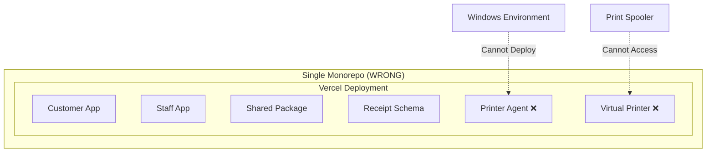

# Design Document

## Overview

The TABEZA Architectural Restructure addresses the fundamental architectural violation of mixing Vercel-hosted cloud services with Windows-based on-premises infrastructure. The current monorepo contains components that cannot coexist in the same deployment environment, creating deployment brittleness and wrong abstractions.

This design implements a clean separation following the principle: **"Vercel hosts intent and configuration. The agent executes reality."**

## Architecture

### Current Architecture (Problematic)



### Target Architecture (Correct)

```mermaid
graph TB
    subgraph "Cloud System (Vercel)"
        subgraph "Apps"
            A[Customer PWA]
            B[Staff Dashboard]
        end
        subgraph "Pure Packages"
            C[Shared Business Logic]
            D[Receipt Schema 🔑]
            E[ESC/POS Parser]
            F[Tax Rules Engine]
            G[Validation Library]
        end
    end
    
    subgraph "Agent System (Windows)"
        subgraph "Infrastructure"
            H[Windows Service]
            I[Print Capture]
            J[Spooler Monitor]
        end
        subgraph "Storage"
            K[SQLite Database]
            L[Sync Queue]
            M[Offline Cache]
        end
        subgraph "Linked Schemas"
            N[Receipt Schema 🔗]
        end
    end
    
    D -->|npm publish| N
    E -->|npm publish| Agent System
    
    Cloud System -->|API| Agent System
    Agent System -->|Data Sync| Cloud System
```

## Components and Interfaces

### Cloud System Components

#### 1. Applications Layer
- **Customer PWA** (`apps/customer/`)
  - QR code scanning and tab management
  - Menu browsing and order placement
  - Payment processing interfaces
  - Real-time order status updates

- **Staff Dashboard** (`apps/staff/`)
  - Order management and approval
  - Payment processing and reconciliation
  - Bar configuration and settings
  - Reporting and analytics

#### 2. Pure Business Logic Layer
- **Shared Package** (`packages/shared/`)
  - Database types and API interfaces
  - Business logic utilities (pure functions only)
  - Validation and formatting functions
  - React hooks for real-time subscriptions

- **ESC/POS Parser** (`packages/escpos-parser/`)
  - Pure parsing logic extracted from virtual-printer
  - Format detection algorithms
  - Command interpretation without OS dependencies
  - Testable in serverless environments

- **Tax Rules Engine** (`packages/tax-rules/`)
  - KRA compliance logic
  - Tax calculation algorithms
  - Jurisdiction-specific rules
  - Pure mathematical functions

- **Validation Library** (`packages/validation/`)
  - Schema validation utilities
  - Business rule enforcement
  - Data sanitization functions
  - Cross-system validation consistency

#### 3. Schema Layer
- **Receipt Schema** (`packages/receipt-schema/`)
  - Canonical data model definitions
  - Zod validation schemas
  - Type definitions for TypeScript
  - Migration utilities for version management

### Agent System Components

#### 1. Service Layer
- **Windows Service Controller**
  - Service lifecycle management (start/stop/restart)
  - Auto-start configuration and recovery
  - Service registration and uninstallation
  - Health monitoring and diagnostics

- **Print Spooler Monitor**
  - Windows print spooler integration
  - Print job interception and capture
  - Printer driver communication
  - Job queue management

#### 2. Processing Layer
- **Print Capture Engine**
  - Raw print data extraction
  - Format detection and routing
  - Data preprocessing and cleanup
  - Confidence scoring for parsed data

- **Receipt Processor**
  - Integration with pure parsing logic
  - Session management and correlation
  - Data validation and enrichment
  - Error handling and retry logic

#### 3. Storage Layer
- **SQLite Database**
  - Local data persistence
  - Transaction management
  - Schema migration support
  - Backup and recovery utilities

- **Sync Queue Manager**
  - Offline-first data queuing
  - Priority-based synchronization
  - Retry logic with exponential backoff
  - Connection state management

#### 4. Integration Layer
- **Schema Consumer**
  - npm package consumption of receipt schema
  - Version compatibility checking
  - Automatic schema updates
  - Migration execution

- **Cloud API Client**
  - RESTful API communication
  - Authentication and authorization
  - Data synchronization protocols
  - Error handling and recovery

## Data Models

### Shared Schema Model

```typescript
// packages/receipt-schema/src/index.ts
export interface ReceiptSession {
  tabeza_receipt_id: string;
  merchant_id: string;
  merchant_name: string;
  printer_id: string;
  session_start: string;
  session_end?: string;
  status: 'OPEN' | 'CLOSED' | 'CANCELLED';
  table_number?: string;
  customer_identifier?: string;
  kra_pin?: string;
}

export interface ReceiptEvent {
  event_id: string;
  session_id: string;
  sequence: number;
  type: 'SALE' | 'REFUND' | 'PARTIAL_BILL' | 'VOID';
  items: LineItem[];
  payment?: Payment;
  raw_hash: string;
  parsed_confidence: number;
  created_at: string;
}

export interface CompleteReceiptSession {
  session: ReceiptSession;
  events: ReceiptEvent[];
  totals: SessionTotals;
  validation: ValidationResult;
}
```

### Agent System Models

```typescript
// Agent-specific models for local storage
interface LocalReceiptJob {
  job_id: string;
  printer_name: string;
  raw_data: Buffer;
  captured_at: string;
  processing_status: 'PENDING' | 'PROCESSING' | 'COMPLETED' | 'FAILED';
  sync_status: 'PENDING' | 'SYNCED' | 'FAILED';
  retry_count: number;
  last_error?: string;
}

interface SyncQueueItem {
  queue_id: string;
  data_type: 'RECEIPT_SESSION' | 'RECEIPT_EVENT' | 'HEALTH_STATUS';
  payload: any;
  priority: 'LOW' | 'NORMAL' | 'HIGH' | 'CRITICAL';
  created_at: string;
  scheduled_at: string;
  attempts: number;
  max_attempts: number;
  last_error?: string;
}
```

### Cloud System Models

```typescript
// Cloud-specific models for API interfaces
interface CloudReceiptSession extends ReceiptSession {
  cloud_metadata: {
    received_at: string;
    source_agent: string;
    processing_version: string;
    validation_score: number;
  };
}

interface AgentHealthStatus {
  agent_id: string;
  merchant_id: string;
  status: 'ONLINE' | 'OFFLINE' | 'DEGRADED';
  last_heartbeat: string;
  version: string;
  capabilities: string[];
  metrics: {
    receipts_processed_24h: number;
    sync_success_rate: number;
    storage_usage_mb: number;
    uptime_hours: number;
  };
}
```

## Correctness Properties

*A property is a characteristic or behavior that should hold true across all valid executions of a system-essentially, a formal statement about what the system should do. Properties serve as the bridge between human-readable specifications and machine-verifiable correctness guarantees.*

Based on the prework analysis, here are the key properties that need to be validated:

### Property 1: Cloud System Purity
*For any* component in the Cloud_System, scanning its dependencies should reveal no OS-specific imports or Windows-specific modules
**Validates: Requirements 1.1, 1.4**

### Property 2: Agent System Infrastructure Focus
*For any* component in the Agent_System, it should either be infrastructure-related or be a pure logic package consumed via npm
**Validates: Requirements 1.2, 4.5**

### Property 3: Architectural Boundary Enforcement
*For any* component placement decision, the component should be in the repository that matches its dependency profile (pure logic in cloud, OS-dependent in agent)
**Validates: Requirements 1.3**

### Property 4: Schema Consumption Consistency
*For any* data validation operation, both Cloud_System and Agent_System should produce identical validation results when using the shared schema
**Validates: Requirements 2.2, 2.5**

### Property 5: Schema Version Compatibility
*For any* schema version update, older versions should be able to validate data structures created by newer versions (backward compatibility)
**Validates: Requirements 2.3, 6.1, 6.3**

### Property 6: Pure Logic Serverless Compatibility
*For any* pure logic package, it should execute successfully in a restricted environment that blocks file system and OS API access
**Validates: Requirements 3.1, 3.3, 3.5**

### Property 7: Pure Logic Cross-System Usability
*For any* pure logic package, it should be importable and functional in both Cloud_System and Agent_System contexts
**Validates: Requirements 3.2**

### Property 8: Agent Offline Operation
*For any* period when the cloud system is unavailable, the Agent_System should continue capturing and queuing receipt data
**Validates: Requirements 5.4**

### Property 9: Deployment Independence
*For any* system update (cloud or agent), the other system should continue operating without conflicts or interruptions
**Validates: Requirements 5.5**

### Property 10: Schema Version Validation
*For any* agent startup, the system should validate schema version compatibility and provide appropriate error messages for mismatches
**Validates: Requirements 6.2, 6.4**

### Property 11: Cross-Version Data Consistency
*For any* data processed by both systems with different schema versions, the core data integrity should be maintained across version boundaries
**Validates: Requirements 6.5**

### Property 12: Migration Functional Preservation
*For any* existing functionality test, it should pass both before and after the architectural migration
**Validates: Requirements 7.1, 7.2**

### Property 13: Migration Validation Completeness
*For any* migration step, the validation procedures should correctly identify whether the separation was successful
**Validates: Requirements 7.3**

### Property 14: Git History Preservation
*For any* component extracted to the agent repository, its commit history should be preserved in the new location
**Validates: Requirements 7.4**

### Property 15: Package Linking Flexibility
*For any* development or production scenario, the package linking mechanism should work correctly (npm link for development, npm install for production)
**Validates: Requirements 8.2, 8.5**

### Property 16: Independent Schema Updates
*For any* schema update publication, the Agent_System should be able to update its schema dependency without affecting Cloud_System operation
**Validates: Requirements 8.4**

### Property 17: Test Suite Preservation
*For any* extracted pure logic component, its existing test suite should continue to pass after extraction
**Validates: Requirements 9.1, 9.3**

### Property 18: Cross-System Integration Testing
*For any* integration test spanning both systems, it should be able to validate end-to-end functionality across the architectural boundary
**Validates: Requirements 9.5**

## Error Handling

### Cloud System Error Handling

**Schema Version Mismatches:**
- Graceful degradation when agent reports incompatible schema version
- Clear error messages with upgrade instructions
- Fallback to basic functionality when possible

**Agent Communication Failures:**
- Retry logic with exponential backoff
- Circuit breaker pattern for persistent failures
- Health status tracking and alerting

**Pure Logic Failures:**
- Comprehensive error logging with context
- Fallback to safe defaults where applicable
- Input validation to prevent invalid data propagation

### Agent System Error Handling

**Service Lifecycle Errors:**
- Automatic service restart on crashes
- Error logging to Windows Event Log
- Health monitoring with recovery procedures

**Print Capture Failures:**
- Graceful handling of printer driver issues
- Retry mechanisms for transient failures
- Fallback to basic text capture when parsing fails

**Sync Queue Errors:**
- Persistent storage of failed sync attempts
- Priority-based retry scheduling
- Dead letter queue for permanently failed items

**Schema Compatibility Errors:**
- Clear error messages for version mismatches
- Automatic schema update prompts
- Graceful degradation to compatible subset

### Cross-System Error Handling

**Network Connectivity Issues:**
- Offline-first design with local queuing
- Connection state monitoring and recovery
- Bandwidth-aware sync strategies

**Data Consistency Errors:**
- Conflict resolution strategies for concurrent updates
- Data integrity validation across system boundaries
- Rollback mechanisms for failed synchronizations

## Testing Strategy

### Dual Testing Approach

The testing strategy employs both unit testing and property-based testing to ensure comprehensive coverage:

**Unit Tests:**
- Specific examples and edge cases
- Integration points between components
- Error conditions and boundary cases
- Windows-specific functionality (agent system)
- API endpoints and web interfaces (cloud system)

**Property Tests:**
- Universal properties across all inputs
- Cross-system consistency validation
- Schema compatibility across versions
- Architectural boundary enforcement
- Data integrity preservation

### Property-Based Testing Configuration

**Testing Library:** fast-check for TypeScript/JavaScript components
**Test Iterations:** Minimum 100 iterations per property test
**Test Tagging:** Each property test tagged with format: **Feature: tabeza-architectural-restructure, Property {number}: {property_text}**

### Cloud System Testing

**Web Application Tests:**
- React component testing with @testing-library/react
- API endpoint testing with supertest
- Integration testing with test database
- PWA functionality testing
- Real-time subscription testing

**Pure Logic Tests:**
- Isolated testing without OS dependencies
- Property-based testing for parsing algorithms
- Schema validation testing
- Business rule enforcement testing
- Cross-browser compatibility testing

### Agent System Testing

**Windows Service Tests:**
- Service lifecycle testing (install/start/stop/uninstall)
- Print spooler integration testing
- SQLite database operation testing
- Offline queue management testing
- Health monitoring and recovery testing

**Integration Tests:**
- End-to-end receipt processing workflows
- Cloud synchronization testing
- Schema version compatibility testing
- Error handling and recovery testing
- Performance and resource usage testing

### Cross-System Integration Testing

**Communication Tests:**
- API communication between systems
- Data synchronization validation
- Schema consistency verification
- Error propagation and handling
- Performance under load

**Deployment Tests:**
- Independent deployment validation
- Version compatibility testing
- Rollback procedure validation
- Migration success verification
- Documentation accuracy testing

### Testing Infrastructure

**Continuous Integration:**
- Separate CI pipelines for each system
- Cross-system integration test suite
- Automated property test execution
- Performance regression testing
- Security vulnerability scanning

**Test Environments:**
- Cloud system: Vercel preview deployments
- Agent system: Windows VM test environments
- Integration: Hybrid cloud/on-premises setup
- Schema: Isolated npm package testing
- Documentation: Automated setup validation

<function_calls>
<invoke name="prework">
<parameter name="featureName">tabeza-architectural-restructure