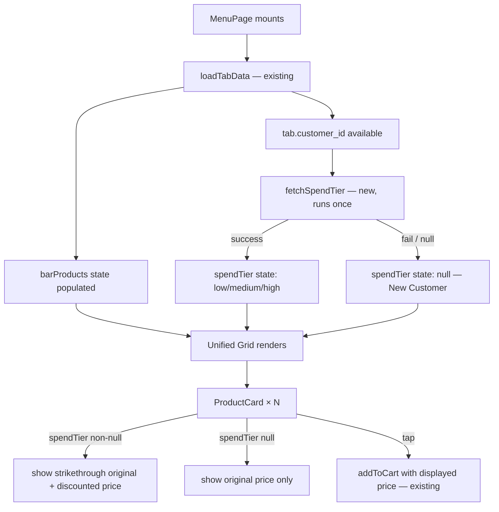

# Design Document: Unified Menu & Loyalty Pricing

## Overview

This design covers two focused changes to `app/menu/page.tsx`:

1. Replace the separate FOOD and DRINKS carousel sections with a single 2-column product grid.
2. Silently apply a spend-tier-based percentage discount to displayed prices, showing the original price crossed out alongside the discounted price.

All other page sections (cart, payment, orders, messages, tab header, connection status, real-time subscriptions) are preserved without modification.

The implementation is additive and non-destructive: existing state, helpers, and functions remain intact. New state and helpers are added alongside them.

---

## Architecture

The feature lives entirely within `app/menu/page.tsx`. No new pages, API routes, or shared packages are introduced.



### Key design decisions

- `fetchSpendTier` is a new `useEffect` that fires once when `tab?.customer_id` and `tab?.bar_id` are both available. It calls the existing `/api/loyalty/spend-tiers/[customerId]` endpoint (already present in the customer app) and reads `spendTier` from the response. The staff-app endpoint `/api/loyalty/tier/[customerId]?barId=...` is not accessible from the customer app; the customer app's own spend-tiers route is used instead.
- The discount is applied at render time only via a pure `applyDiscount(price, tier)` helper. It never mutates `barProduct.sale_price`.
- `addToCart` is called with a price argument override so the cart records the displayed price. The existing `addToCart` function signature is extended with an optional `priceOverride` parameter — the original function body is preserved and the override is applied only when provided.
- The existing `loadLoyaltyData` function (which fetches visit tier + spend tier for the loyalty icon display) is left intact. The new `fetchSpendTier` is a separate, lighter fetch that reads only `spendTier` for pricing purposes.

---

## Components and Interfaces

### New state

```ts
// Spend tier for pricing only (separate from loyaltyData which drives the icon display)
const [spendTier, setSpendTier] = useState<'low' | 'medium' | 'high' | null>(null);
```

### New helper: `applyDiscount`

```ts
const TIER_DISCOUNTS: Record<'low' | 'medium' | 'high', number> = {
  low: 1.5,
  medium: 3,
  high: 5,
};

/**
 * Returns the discounted price rounded to the nearest whole KES.
 * Does NOT mutate the source price.
 */
function applyDiscount(price: number, tier: 'low' | 'medium' | 'high'): number {
  const pct = TIER_DISCOUNTS[tier];
  return Math.round(price * (1 - pct / 100));
}
```

### New effect: `fetchSpendTier`

```ts
useEffect(() => {
  if (!tab?.customer_id) return;

  let cancelled = false;
  fetch(`/api/loyalty/spend-tiers/${tab.customer_id}`)
    .then(r => {
      if (!r.ok) throw new Error(`HTTP ${r.status}`);
      return r.json();
    })
    .then(data => {
      if (cancelled) return;
      const tier = data?.spendTier ?? null;
      if (tier === 'low' || tier === 'medium' || tier === 'high') {
        setSpendTier(tier);
      }
      // null / unknown → leave spendTier as null (New Customer)
    })
    .catch(() => {
      // Silent failure — New Customer treatment
    });

  return () => { cancelled = true; };
}, [tab?.customer_id]);
```

### Modified: `addToCart`

The existing `addToCart` function records `barProduct.sale_price` as the cart price. To record the displayed price instead, a `priceOverride` parameter is added. The original function body is preserved; the override is applied only when provided.

```ts
// Original signature (preserved):
// const addToCart = (barProduct: BarProduct) => { ... price: barProduct.sale_price ... }

// New signature (additive — original body unchanged, override applied at price assignment):
const addToCart = (barProduct: BarProduct, priceOverride?: number) => {
  const product = barProduct.product;
  if (!product) return;
  const newItem = {
    bar_product_id: barProduct.id,
    product_id: barProduct.product_id,
    name: product.name,
    price: priceOverride ?? barProduct.sale_price,  // ← only change
    category: product.category,
    image_url: product.image_url,
    quantity: 1
  };
  const newCart = [...cart, newItem];
  setCart(newCart);
  sessionStorage.setItem('cart', JSON.stringify(newCart));
  showToast({ type: 'success', title: 'Added to Cart! 🛒', message: `${product.name} has been added to your cart` });
};
```

### New component: `UnifiedGrid`

Rendered inline within `MenuPage` (not extracted to a separate file, to minimise diff surface).

```tsx
{/* Unified 2-column product grid — replaces FOOD and DRINKS carousel sections */}
{loading ? (
  <LoadingState />
) : sortedProducts.length === 0 ? (
  <EmptyState />
) : (
  <div className="grid grid-cols-2 gap-3 px-4 pb-6">
    {sortedProducts.map(bp => {
      const displayPrice = spendTier ? applyDiscount(bp.sale_price, spendTier) : bp.sale_price;
      const showStrikethrough = spendTier !== null && displayPrice !== bp.sale_price;
      const imageUrl = getDisplayImage(bp.product);
      const IconComponent = getCategoryIcon(bp.product?.category || '');

      return (
        <button
          key={bp.id}
          onClick={() => addToCart(bp, displayPrice)}
          className="flex flex-col rounded-xl overflow-hidden bg-white/10 active:scale-95 transition-transform"
        >
          {/* Image area */}
          <div className="w-full aspect-square bg-white/5 flex items-center justify-center overflow-hidden">
            {imageUrl ? (
              
            ) : (
              <IconComponent className="w-10 h-10 text-white/50" />
            )}
          </div>
          {/* Name + price */}
          <div className="p-2 flex flex-col gap-0.5">
            <span className="text-white text-sm font-medium leading-tight line-clamp-2">
              {bp.product?.name}
            </span>
            <div className="flex items-baseline gap-1.5 flex-wrap">
              {showStrikethrough && (
                <span className="text-white/40 text-xs line-through">
                  {tempFormatCurrency(bp.sale_price)}
                </span>
              )}
              <span className="text-white text-sm font-semibold">
                {tempFormatCurrency(displayPrice)}
              </span>
            </div>
          </div>
        </button>
      );
    })}
  </div>
)}
```

### Derived value: `sortedProducts`

```ts
const sortedProducts = [...barProducts].sort((a, b) =>
  (a.product?.name ?? '').localeCompare(b.product?.name ?? '')
);
```

This replaces the existing `filteredProducts` sort (which is still used by any remaining search/filter logic elsewhere on the page) — `sortedProducts` is a new derived value used only by the Unified Grid.

---

## Data Models

No new database tables or API schemas are introduced.

### Spend tier response (existing `/api/loyalty/spend-tiers/[customer_id]`)

```ts
interface SpendTierResponse {
  totalSpend: number;
  weeklySpend: number;
  spendTier: 'low' | 'medium' | 'high';
  customer_id: string;
}
```

### Cart item (existing shape, price field now reflects displayed price)

```ts
interface CartItem {
  bar_product_id: string;
  product_id: string;
  name: string;
  price: number;          // displayed price (discounted if tier applies)
  category: string;
  image_url?: string;
  quantity: number;
}
```

### Discount mapping (hardcoded)

| spend_tier | discount |
|------------|----------|
| low        | 1.5%     |
| medium     | 3%       |
| high       | 5%       |

---

## Correctness Properties

*A property is a characteristic or behavior that should hold true across all valid executions of a system — essentially, a formal statement about what the system should do. Properties serve as the bridge between human-readable specifications and machine-verifiable correctness guarantees.*

### Property 1: All active products appear in the grid

*For any* set of active bar products with mixed categories, every product should appear exactly once in the Unified Grid, regardless of its category.

**Validates: Requirements 1.1, 1.2**

---

### Property 2: Products are sorted alphabetically

*For any* set of bar products, the order in which product cards are rendered should match the lexicographic sort of their names.

**Validates: Requirements 1.10**

---

### Property 3: Product card image area correctness

*For any* bar product, if `image_url` is non-null the card renders an `` with that src; if `image_url` is null the card renders the category icon component instead.

**Validates: Requirements 1.6, 1.7**

---

### Property 4: Product name is always rendered

*For any* bar product, the rendered product card contains the product's name as visible text.

**Validates: Requirements 1.8**

---

### Property 5: Tap invokes addToCart with the displayed price

*For any* bar product and any spend tier (including null), tapping the product card should invoke `addToCart` with a price equal to `applyDiscount(sale_price, tier)` when a tier is present, or `sale_price` when no tier is present.

**Validates: Requirements 1.9, 3.7**

---

### Property 6: Discount calculation formula

*For any* sale price and any spend tier (`low`, `medium`, `high`), `applyDiscount(price, tier)` should equal `Math.round(price * (1 - TIER_DISCOUNTS[tier] / 100))`.

**Validates: Requirements 2.6, 3.4**

---

### Property 7: Spend tier fetch fires exactly once

*For any* component mount with a valid `customer_id`, the spend tier fetch should be called exactly once, not on subsequent re-renders.

**Validates: Requirements 2.2**

---

### Property 8: No loyalty labels in rendered output

*For any* product card and any spend tier state, the rendered card text should not contain the strings "discount", "loyalty", "your price", "offer", "bronze", "silver", or "gold".

**Validates: Requirements 3.3**

---

### Property 9: Strikethrough shown iff tier is non-null and price differs

*For any* bar product, the original price with strikethrough styling is rendered if and only if `spendTier` is non-null and `applyDiscount(sale_price, tier) !== sale_price`.

**Validates: Requirements 3.1, 3.5**

---

### Property 10: sale_price is not mutated

*For any* bar product in state, after the loyalty price layer is applied at render time, the `sale_price` field on the object in state should remain equal to its original value.

**Validates: Requirements 3.6**

---

## Error Handling

| Scenario | Behaviour |
|---|---|
| Spend tier API returns non-2xx | `spendTier` stays `null`; all prices show as original only |
| Spend tier API returns `null` or unknown tier value | `spendTier` stays `null`; New Customer treatment |
| `tab.customer_id` is absent | `fetchSpendTier` effect does not run; New Customer treatment |
| `barProducts` is empty | Unified Grid renders empty-state message |
| Product has no `product` object | Card is skipped (existing guard in `addToCart`) |
| Network error during tier fetch | Caught silently; no error shown to user |

No error UI is shown to the customer for any loyalty-related failure. The page degrades gracefully to showing original prices.

---

## Testing Strategy

### Unit tests (Jest + React Testing Library)

Focus on specific examples and edge cases:

- Example: old FOOD/DRINKS section elements are absent from the rendered output (Requirements 1.3, 1.4, 1.5)
- Example: loading state renders when `loading=true` (Requirement 1.11)
- Example: empty-state message renders when `barProducts=[]` (Requirement 1.12)
- Example: fetch is called with the correct URL when `customer_id` is present (Requirement 2.1)
- Edge case: API returns 500 → prices show without strikethrough (Requirement 2.3)
- Edge case: API returns `{ spendTier: null }` → prices show without strikethrough (Requirement 2.4)

### Property-based tests (fast-check)

The project already uses `fast-check` (listed in `AGENTS.md`). Each property test runs a minimum of 100 iterations.

Tag format: `Feature: unified-menu-loyalty-pricing, Property {N}: {property_text}`

| Property | Test description |
|---|---|
| P1 | Generate random arrays of BarProduct; render grid; assert every product id appears exactly once |
| P2 | Generate random arrays of BarProduct; render grid; assert rendered name order matches `.sort localeCompare` |
| P3 | Generate BarProduct with arbitrary image_url (string or null); assert img vs icon rendering |
| P4 | Generate BarProduct with arbitrary name; assert name text is present in rendered card |
| P5 | Generate BarProduct + arbitrary tier; simulate tap; assert addToCart called with correct price |
| P6 | Generate arbitrary price (positive integer) + arbitrary tier; assert `applyDiscount` output matches formula |
| P7 | Mount component; trigger multiple re-renders; assert fetch called exactly once |
| P8 | Generate BarProduct + arbitrary tier; render card; assert no loyalty label strings present |
| P9 | Generate BarProduct + tier (null or valid); render card; assert strikethrough presence matches condition |
| P10 | Generate BarProduct; apply loyalty layer; assert `sale_price` in state object unchanged |

Each property-based test must include a comment:
```ts
// Feature: unified-menu-loyalty-pricing, Property N: <property_text>
```
