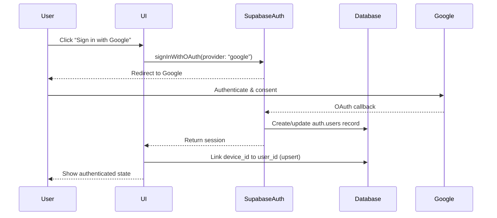
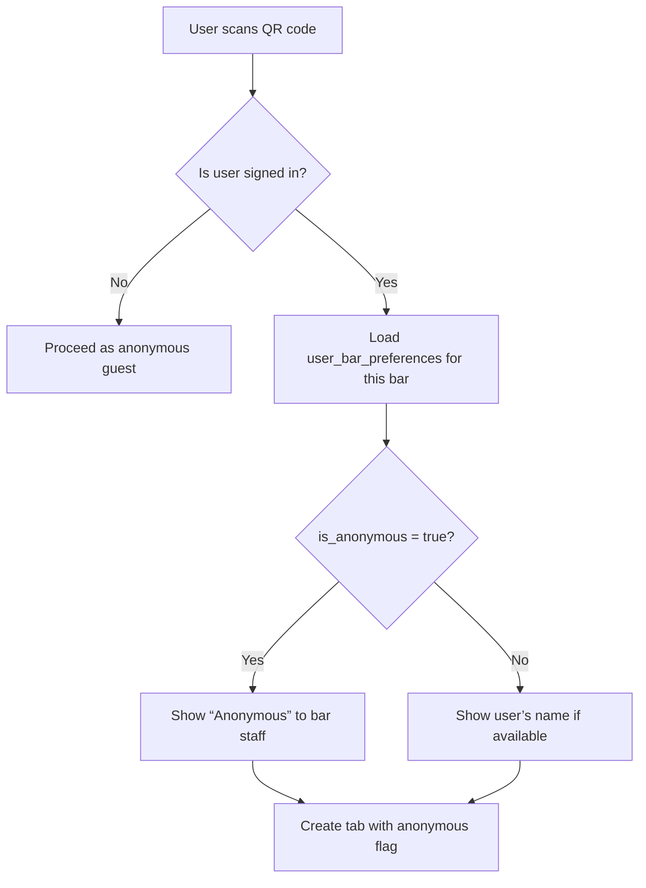

# Google Sign-In Upgrade & Anonymous Checkbox Mode Plan

## Overview
This plan outlines the implementation of three interconnected features:
1. **Google Sign-In Upgrade**: Allow users to authenticate with Google, linking their device identity to a user account for better cross-device experience and saved preferences.
2. **Anonymous Checkbox Mode**: Provide users the option to keep their name private from restaurants while the system still collects their details internally.
3. **Saved Restaurants Feature**: Enable users to save favorite bars for quick reconnection without scanning QR codes.

## Current State Analysis
- Authentication: Currently device‑based only (no user accounts). Device ID stored in `localStorage` and used as `owner_identifier` in the `tabs` table.
- Database: Supabase with `auth.users` (built‑in) and public tables (`tabs`, `bars`, `user_bars`, etc.). No `users` table in public schema.
- UI: Landing page (`/`) and consent page (`/start`) handle bar connection. No authentication UI.

## 1. Google Sign‑In Upgrade

### 1.1 Supabase OAuth Configuration
- Enable Google OAuth provider in Supabase Dashboard.
- Verify existing environment variables (`NEXT_PUBLIC_SUPABASE_URL`, `NEXT_PUBLIC_SUPABASE_PUBLISHABLE_KEY`, `SUPABASE_SECRET_KEY`) are correctly set.
- Configure authorized redirect URIs (e.g., `http://localhost:3002/auth/callback`).

### 1.2 UI Component
- Create a reusable `GoogleSignInButton` component that uses `supabaseClient.auth.signInWithOAuth`.
- Placement: Initially on the landing page (optional sign‑in) and later in a user profile dropdown.
- Show user avatar and sign‑out button when authenticated.

### 1.3 Sign‑In Flow
- Use `supabaseClient.auth.onAuthStateChange` to listen for authentication changes.
- Store the user’s `id` (from `auth.users`) in local state (React context or Zustand).
- After sign‑in, link the current device ID to the user via a new `user_devices` table (or add `user_id` column to `tabs`).

### 1.4 Linking Device Identity
- **Database schema changes**:
  - Option A: Add `user_id` (nullable UUID referencing `auth.users`) to the `tabs` table.
  - Option B: Create a `user_devices` table (`user_id`, `device_id`, `created_at`) to map multiple devices to one user.
- **Migration**: Existing tabs remain device‑only (`user_id = NULL`). New tabs opened after sign‑in will have `user_id` set.
- **API updates**: Modify `/api/tabs/open` to include `user_id` if the user is authenticated.

## 2. Anonymous Checkbox Mode

### 2.1 Database Schema
Create a `user_bar_preferences` table:
```sql
CREATE TABLE user_bar_preferences (
  id UUID PRIMARY KEY DEFAULT gen_random_uuid(),
  user_id UUID NOT NULL REFERENCES auth.users(id) ON DELETE CASCADE,
  bar_id UUID NOT NULL REFERENCES bars(id) ON DELETE CASCADE,
  is_anonymous BOOLEAN NOT NULL DEFAULT false,
  created_at TIMESTAMPTZ DEFAULT NOW(),
  updated_at TIMESTAMPTZ DEFAULT NOW(),
  UNIQUE(user_id, bar_id)
);
```

### 2.2 UI Integration
- Add a checkbox “Keep my name private from this restaurant” on the bar connection page (`/start`).
- The checkbox should be pre‑checked if the user has previously set `is_anonymous = true` for this bar.
- Store the preference via a new API endpoint (`POST /api/user-bar-preferences`) when the user toggles it.

### 2.3 Tab Creation Modifications
- When opening a new tab (`/api/tabs/open`), check the user’s anonymous preference for the bar.
- If `is_anonymous = true`, the tab’s `owner_identifier` can be masked (e.g., “Anonymous‑{device‑id‑suffix}”) or a flag `is_anonymous` added to the `tabs` table.
- The bar’s staff interface should respect the anonymous flag and not display the customer’s real name (if stored).

## 3. Saved Restaurants Feature

### 3.1 Database Schema
Create a `saved_bars` table:
```sql
CREATE TABLE saved_bars (
  id UUID PRIMARY KEY DEFAULT gen_random_uuid(),
  user_id UUID NOT NULL REFERENCES auth.users(id) ON DELETE CASCADE,
  bar_id UUID NOT NULL REFERENCES bars(id) ON DELETE CASCADE,
  created_at TIMESTAMPTZ DEFAULT NOW(),
  UNIQUE(user_id, bar_id)
);
```

### 3.2 API Endpoints
- `GET /api/saved-bars` – list the authenticated user’s saved bars.
- `POST /api/saved-bars` – save a bar (expects `{ bar_id }`).
- `DELETE /api/saved-bars/:barId` – unsave a bar.

### 3.3 UI Page
- Create a new page `/saved` that displays a grid of saved bars with their name, location, and a “Connect” button that directly navigates to the bar’s menu (using the bar’s slug).
- Add a “Save this bar” button on the menu page (`/menu`) that toggles saved state.

## 4. Implementation Steps (Phased)

### Phase 1: Google Sign‑In (Week 1)
1. Configure Google OAuth in supabaseClient.
2. Create `GoogleSignInButton` component.
3. Implement sign‑in flow and auth state listener.
4. Add `user_id` column to `tabs` table (nullable).
5. Update `/api/tabs/open` to set `user_id` when authenticated.

### Phase 2: Anonymous Checkbox (Week 2)
1. Create `user_bar_preferences` table.
2. Add checkbox UI to `/start` page.
3. Create API endpoint for preferences.
4. Modify tab creation to respect anonymous flag.
5. Update bar staff UI (if necessary) to hide anonymous customer names.

### Phase 3: Saved Restaurants (Week 3)
1. Create `saved_bars` table.
2. Implement API endpoints.
3. Build `/saved` page with quick‑connect functionality.
4. Add “Save” toggle on menu page.

### Phase 4: Testing & Polish (Week 4)
1. Write unit/integration tests for new endpoints.
2. Ensure backward compatibility (device‑only users still work).
3. Update documentation (AGENTS.md).
4. Deploy and monitor.

## 5. Diagrams

### 5.1 Authentication Flow


### 5.2 Anonymous Preference Flow


## 6. Risks & Mitigations
- **Risk**: Existing device‑only users may lose their tabs when signing in.
  - **Mitigation**: Keep `user_id` optional; only link new tabs. Provide a migration script later.
- **Risk**: Google OAuth configuration errors (redirect URIs).
  - **Mitigation**: Thorough testing in development environment.
- **Risk**: Performance impact of additional joins.
  - **Mitigation**: Index foreign keys and monitor query performance.

## 7. Success Metrics
- Increase in user retention (measured by repeat visits).
- Higher bar‑saving rate (percentage of users who save at least one bar).
- Positive feedback on privacy (anonymous mode usage).

---

**Next Step**: Review this plan with the team and approve the database schema changes. After approval, we can proceed with Phase 1 implementation in Code mode.