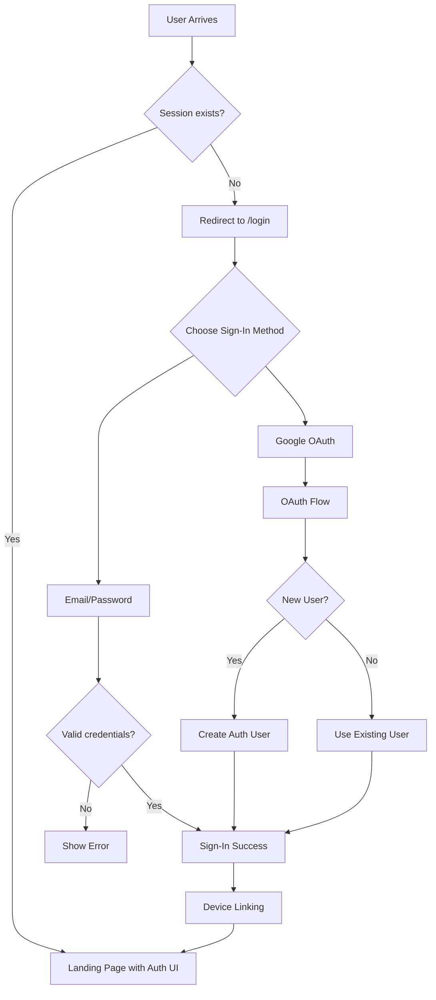

# Authentication Scenarios – Tabeza Customer

## Overview
This document outlines the possible authentication flows for registered and unregistered users in the Tabeza Customer web app. The system uses Supabase Auth with email/password and Google OAuth, enforces email confirmation, and links device identities to user accounts.

---

## Registered User Sign‑In Scenarios

### 1. Successful Email/Password Sign‑In
- User submits valid credentials on `/login`.
- Supabase `signInWithPassword` succeeds.
- Toast “Signed in, Welcome back!” shown, redirect to `/`.
- `useAuth` updates user state and triggers device linking (`/api/user/link‑device`).
- Device ID (non‑temporary) is linked in `user_devices` table.
- Landing page shows user email, “Saved Restaurants”, and sign‑out button.

### 2. Successful Google OAuth Sign‑In
- User clicks “Sign in with Google”.
- OAuth flow redirects to Google, then to `/auth/callback`.
- Callback page waits 2 s, redirects to `/`.
- Supabase creates/updates `auth.users` record.
- Device linking occurs; `user_profiles` upserted.
- User lands on authenticated landing page.

### 3. Already Signed‑In (Valid Session)
- Returning user has active Supabase session.
- `useAuth`’s `checkAuth` retrieves session automatically.
- No explicit sign‑in needed; UI shows authenticated state.

### 4. Sign‑In with Unconfirmed Email
- User signed up but hasn’t clicked confirmation email.
- `signInWithPassword` returns error (e.g., “Email not confirmed”).
- Login page displays generic “Invalid email or password”.
- User must confirm email before signing in.

### 5. Invalid Credentials
- Wrong email or password.
- Supabase error → “Invalid email or password” shown.
- User can retry or use “Forgot password?”.

### 6. Forgot Password Flow
- User enters email, clicks “Forgot password?”.
- `resetPasswordForEmail` sends reset link to `/reset‑password`.
- Toast “Reset Email Sent”.
- After reset, user can sign in with new password.

### 7. Network / Server Error
- Supabase endpoint unreachable or internal error.
- Error message displayed (or generic “Failed to sign in”).
- User prompted to try again.

### 8. Sign‑Out
- User clicks “Sign out” on landing page.
- `supabaseClient.auth.signOut()` clears session and local storage.
- Redirect to `/` → landing page shows sign‑in button.

---

## Unregistered User Sign‑In Scenarios

### 1. Sign‑In Attempt with Non‑Existent Email
- Email not registered in supabaseClient.
- `signInWithPassword` returns “Invalid login credentials”.
- Login page shows “Invalid email or password”.
- User can navigate to sign‑up.

### 2. New User Sign‑Up (Email/Password)
- User submits email and matching password (≥6 chars) on `/signup`.
- `supabaseClient.auth.signUp` creates user and sends confirmation email.
- Toast “Account created. Please check your email to confirm.”
- Redirect to `/` but user remains unauthenticated (no session).
- Landing page redirects to `/login`.

### 3. Sign‑Up with Already Registered Email (Auto Sign‑In)
- Sign‑up detects “already registered” error.
- Automatically attempts sign‑in with the same credentials.
- If successful, user logged in and redirected to `/`.
- If fails, original error shown.

### 4. First‑Time Google OAuth (New User)
- User consents to Google OAuth.
- Supabase creates new `auth.users` record with Google profile.
- No email confirmation required.
- Device linking and profile creation happen as usual.

### 5. Google OAuth for Existing User
- Google email already linked to a Supabase account.
- Supabase merges session; existing user record used.
- Device linking proceeds normally.

### 6. Unregistered User Accesses the App
- User visits `/` without a session.
- `useAuth` detects no user, `authLoading` becomes false.
- Landing page `useEffect` redirects to `/login`.
- Login page prompts sign‑in or sign‑up.

### 7. Unregistered User Scans QR Code Directly
- Direct visit to `/start?bar=...` without authentication.
- `ConsentContent` `useEffect` redirects to `/`.
- Landing page redirects to `/login`.
- **Result:** Authentication is mandatory before tab creation.

---

## Device Linking & Anonymous Mode

### Device Linking on Sign‑In
- After successful sign‑in, `useAuth` calls `linkDeviceToUser`.
- API `POST /api/user/link‑device` upserts `user_devices` record.
- Temporary device IDs (`temp_*`) are skipped.
- Enables cross‑device tab sync and saved restaurants.

### Anonymous Toggle
- Authenticated users see `AnonymousToggle` on landing page.
- Preference stored per‑bar in `localStorage` (`tabeza_anonymous_{barId}`).
- Currently client‑only; future integration with `user_bar_preferences` table.
- When anonymous is true, user’s name is hidden from restaurant staff (implementation pending).

### Tab Creation with Authentication
- Database function `create_tab_if_not_exists` accepts nullable `p_user_id`.
- If user authenticated (`user?.id` exists), tab is linked to that user.
- If not authenticated, `p_user_id` is `null` (tab owned only by device ID).
- Current UI flow requires authentication before reaching consent page, so tabs always have a `user_id` when created via UI.

---

## Error & Edge Cases

- **Supabase Provider Not Configured** – Google OAuth disabled; error message guides admin.
- **Low Device Integrity Score** – `device.integrity.score < 70` blocks tab creation (`validateDeviceForBar`).
- **Duplicate Tab Creation** – `create_tab_if_not_exists` handles race conditions; returns existing tab if present.
- **Bar Closed / Inactive** – Start page checks business hours; shows “Bar Closed” slide‑in.
- **Session Expiry** – `onAuthStateChange` detects sign‑out, clears user state, redirects to login.

---

## Summary Flow

---

*Document generated from code analysis of Tabeza Customer (March 2026).*